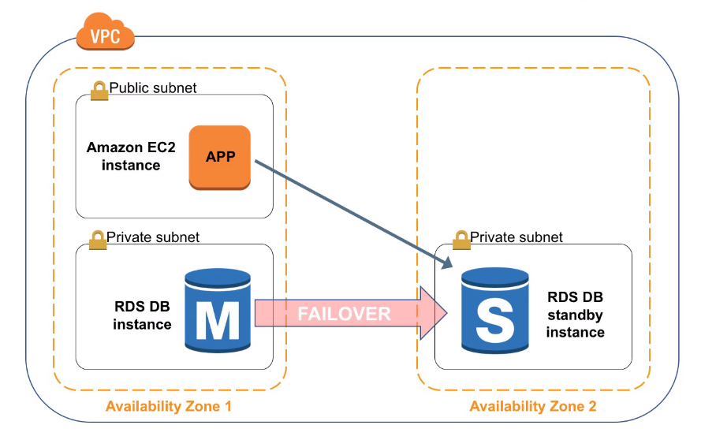
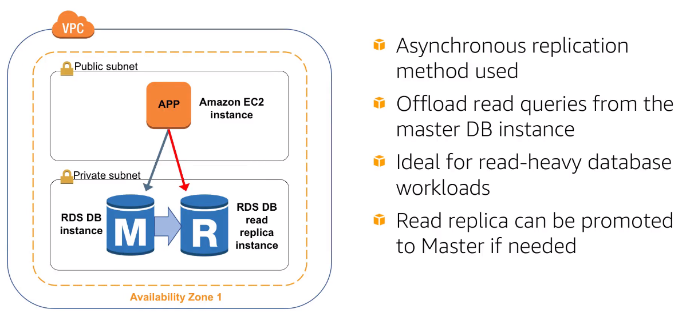

# AWS Cloud Practitioner Essential (Second Edition)

## Module 1: Introduction to the AWS Cloud

### Introduction to the AWS Cloud

#### Cloud Computing

On-demand delivery of IT resources and applications via the internet

#### Risk Management

Pivot quickly, Test often, patch quickly, and respond to incidents at lightning speed

#### Scalability

Ability to resize resources as necessary

- Agility
  - Increasing Speed
  - The ease of experimentation
  - Cultivating a culture of innovation
- Elasticity
  - quickly deploy new applications
  - instantly scale up as the workload grows
  - instantly shut down resources that are no longer required

#### Reliablitity

Ability of a system to recover from infrastructure or service failures. Being able to acquire computing resources to meet demand and mitigate disruptions

- Regions: a separate geographic area that has multiple isolated locations known as Availability Zones
- Availability Zones: one or more discrete data centers with each with redundant power, networking, and connectivity, housed in separate facilities
  - AZ lets you operate production applications and databases that are more highly available, fault-tolerant and scalable
  - Fault tolerance: System can remain operational even if some of the components of that system failures
  - High availability: systems are always functioning and accessible, and that downtime is minimized as much as possible WITHOUT the need for human intervention.

#### Security

### Introduction to AWS Interfaces

#### AWS Management Console

Easy-to-use graphical interface that supports majority of Amazon Web Services

#### Command Line Interface(CLI)

Access to services via discrete command

#### Software Development Kits(SDKs)

Incorporate the connectivity and functionality of the wide range of AWS Cloud services into your code

## Module 2: AWS Core Services

### Amazon Elastic Cloud Compute (EC2)

Meaning:

- Elastic: increase/decrease the amount of servers required by an application automaticallay according to the current demands on that application
- Compute: compute, server, or resources that are being presented
- Cloud: cloud hosted compute resources

Amazon EC2 instances are:

- Pay as you go
- A Broad selections of hardware and Software
- Global hosting

### Amazon Elastic Block Store (EBS)

Overview:

- Choose between HDD and SSD Types
- Persistent and customizable block storage for EC2 instances
- Replicated in the same Availability Zone (with EC2 instances)
- Backup using Snapshots
- Easy and Transparent Encryption
- Elastic volumes

### Amazon Simple Storage Service (S3)

What is Amazon S3?

- Managed cloud storage service
- Store virtually unlimitted number of objects
- Access any time, from anywhere
- Rich security controls

Common Use Cases:

- Storing Application Assets
- Static Web hosting
- Backup & Disaster Recovery
- Staging area for Big Data

### AWS Global Infrastructure

Region:

- Geographic areas that host two or more Availability Zones
- The organizing level for AWS Services
- Completely separate entities from one another

Availability Zones:

- A collection of data centers within a specific region
- Physically, logically separate from the others
- Connected together by a fast, low-latency network

Edge Locations:

- AWS edge locations host a content delivery network, or CDN called CloudFront

### Amazon Virtual Private Cloud (VPC)

Introduction:

- A private, virtual network in the AWS Cloud
  - Uses same concepts as on premise networking
- Allows complete control of network configuration
  - Ability to isolate and expose resources inside VPC
- Offers several Layers of security controls
  - Ability to allow and deny specific internet and internal traffic
- Other AWS services deploy into VPC
  - Services inherent security built into network

Features:

- Builds upon high availability of AWS Regions and Availability Zones (AZ)
- Subnets: Allows Amazon VPC to span multiple AZs
- Route table: Control traffic going out of the subnets
- Internet Gateway (IGW): Allows access to the Internet from Amazon VPC
- NAT Gateway: Allows private subnet resources to access Internet
- Network Access Control Lists(NACL): Control access to subnets; stateless

### AWS Security

Security groups:

- Act as built-in firewalls
- Control accessibility to instances

## Module 3: AWS Integrated Services

### Application Load Balancer

Application Load Balancer is the second type of load balancer introduced as part of the Elastic Load Balancing service. It offers most of the features provided by the Classic Load Balancer, and adds some important features and enhancements that lend it to unique use cases.

**Enhanced Features**:

- Supported Protocols: HTTP, HTTPS, HTTP/2, and WebSockets
- CloudWatch Metrics: Additional load balance metrics and Target Group metric dimension
- Access Logs: Ability to see connection details for WebSocket connections
- Health Checks: Insight into target and application health at more granular level

**Additional Features**:

- Path and Host-based Routing
  - Path-based provides rules that foward requests to different target groups
  - Host-based can be used to define rules that forward requests to different target groups based on host name
- Deletion Protections & Request Tracing
  - Request Tracing can be used to track HTTP requests from clients to target
- Dynamic Ports
  - Amazon ECS integrates with Application Load Balancer to expose Dynamic Ports utilized by scheduled containers
- AWS WAF
- Native IPv6 Support

**Use Case**:

- Use as containers to host micro services and route to the applications from a single load balancer

### Auto Scaling

Auto Scaling helps you ensure that you have the correct number of Amazon EC2 instances available to handle the load for your application.

- Scalability: How can I ensure that my workload has enough EC2 resources to meet fluctuating performance requirements?
- Automation: How can I automate EC2 resource provisioning to occur on-demand?

**Terminology**:

- Scaling Out: Launch Instances
- Scaling In: Terminate Instances

**Auto Scaling Components**: Launce Configuration -> Auto Scaling Group -> Auto Scaling Policy

- Launce Configuration: What?
  - AMI
  - Instance type
  - Security Groups
  - Roles
- Auto Scaling Group: Where?
  - VPC and Subnet(s)
  - Load balancer
  - Minimum instances
  - Maximum instances
  - Desired capacity
- Auto Scaling Policy: When?
  - Scheduled
  - On-demand
  - Scale-out policy
  - Scale-in policy

### Amazon Route 53

DNS(Domain Name System)

### Amazon Relational Database Services(RDS)

Challenges of Relational Databases:

- Server maintenance and Energy footprint
- Software install and patches
- Database backups and high availability
- Limits on scalability
- Data security
- OS install and patches

Amazon RDS is a managed service that sets up and operates a relational database in the cloud.

AWS manages:

- OS installation and patches
- Database software install and patches
- Database backups
- High availability
- Scaling
- Power and rack & stack
- Server maintenance

You manage:

- Application optimization

Amazon RDS DB instances:

- Amazon RDS
  - DB Instance Class
    - CPU
    - Memory
    - Network performance
  - DB Instance Storage
    - Magnetic
    - General purpose (SSD)
    - Provisioned IOPS
- DB Engines
  - MySQL
  - Amazon Aurora
  - MS SQL Server
  - PostgreSQL
  - MariaDB
  - Oracle

How RDS Works:

### AWS Lambda

What is AWS Lambda:

- Fully-Managed serverless compute
- Event-driven execution
- Sub-second metering
- Multiple languages supported

### AWS Elastic Beanstalk

What is AWS Elastic Beanstalk:

- Platform as a Service
- Allows quick deployment of your applications
- Reduces management complexity
- Keeps control in your hands
  - Choose your instance type
  - Choose your database
  - Set and adjust Auto Scaling
  - Update your application
  - Access server log files
  - Enable HTTPS on load balancer
- Supports a large range of platforms
  - GO, Java SE, Node.js ...

Components:

- Application Service
- HTTP Service
- Operating System
- Language interpreter
- Host
