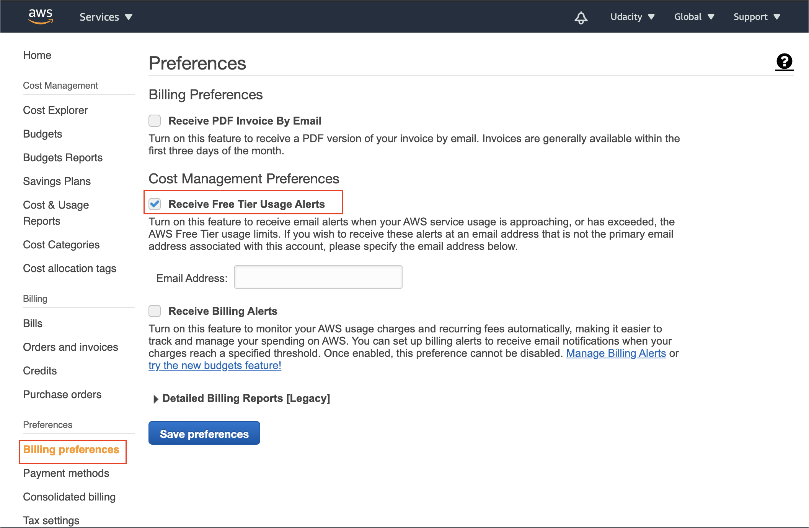

# AWS Free Tier

## What is AWS Free Tier Access?

The [AWS Free Tier Access](https://aws.amazon.com/premiumsupport/knowledge-center/what-is-free-tier/) allows you to test some AWS services free of charge within usage limits, and it is automatically available to new AWS customers for 12 months from the date of account creation. AWS will send a notification to your email address when your Free Tier eligibility approaches expiration.

Please note that not all AWS services are free. **Even though your account may be using the free tier, you also have access to paid services.** You can see the complete list of free services [here](https://aws.amazon.com/free/?all-free-tier.sort-by=item.additionalFields.SortRank&all-free-tier.sort-order=asc). Further, there are a few services that are always free as long as you are using AWS services, such as, Amazon CloudWatch, AWS Lambda, AWS CodePipeline, AWS CodeBuild, and many more.

Below is a summary of a few frequently-used services:

| AWS Service | Yearly Usage Limits |
| --- | --- |
| Amazon EC2 | 12x750 hours of Linux and Windows `t2.micro` instances |
| Amazon RDS | 12x750 Hours of `db.t2.micro` database |
| Amazon S3 | 5 GB standard storage |
| Amazon CloudFront | 50GB of data transfer |
| AWS CodePipeline | 1 active pipeline per month |
| AWS CodeBuild | 100 build minutes (in free tier) |

You are responsible for any charges you incur while using AWS services.

## How to Check Your Free Tier Usage

As stated earlier, AWS Free Tier is automatically activated on every new AWS account. However, if you have an existing AWS account, but you’re unsure whether it’s still eligible for the Free Tier category, open your [AWS Billing Dashboard](https://console.aws.amazon.com/billing/home#/). If your account is still using the AWS Free Tier resources, you will see the resource usage statistics for the free tier services. See the snapshot below:

## How to Set up Free Tier Usage Alerts?

By default, accounts in the Free tier option category are automatically opted to receive email alerts when their service usage exceeds 85% of the limit. Under the Free Tier account, you can follow these steps to receive additional notification alerts for every resource usage when your account is approaching or has exceeded the AWS Free Tier usage limits:

1. Go to the [AWS Billing Dashboard](https://console.aws.amazon.com/billing/home#/)
2. Under the Preferences section in the navigation pane, choose **Billing preferences**.
3. Select the checkbox against the **Receive Free Tier Usage Alerts**. See the snapshot below.

You can find out more details [here](https://docs.aws.amazon.com/awsaccountbilling/latest/aboutv2/tracking-free-tier-usage.html). Note that AWS offers additional paid alerts, some of the examples are:

- [Budgets](https://console.aws.amazon.com/billing/home#/budgets) - Create a budget to restrict AWS resource usage. You will be notified when your AWS usage or cost exceeds the allocated budget. You can generate and send reports for each budget you have allocated.
- [Saving Plans](https://console.aws.amazon.com/cost-management/home#/savings-plans/overview) - According to AWS,
  > Saving Plans are a flexible pricing model that offers low prices on AWS usage, in exchange for a commitment to a consistent amount of usage (measured in $/hour) for a 1- or 3-year term.
- [Cost & Usage Reports](https://console.aws.amazon.com/billing/home#/reports) - It allows you to access detailed data about incurred costs and usages helping you to analyze your usage trends.

Please be aware that these additional services, when enabled, will incur some charges.
