# Book Summary

## Introduction

### Why Do Our Designs Go Wrong

Software systems tend toward chaos. When we first start building a new system, we have grand ideas that our code will be clean and well ordered, but over time we find that it gathers cruft and edge cases and ends up a confusing morass of manager classes and util modules.

### Encapsulation and Abstractions

Encapsulation covers two closely related ideas:

- Simplifying behavior
- Hiding data.

We encapsulate behavior by identifying a task that needs to be done in our code and giving that task to a well-defined object or function. We call that object or function an **abstraction**.

*Encapsulating behavior by using abstractions is a powerful tool for making code more expressive, more testable, and easier to maintain.*

### Layering

In a big ball of mud, the dependencies are out of control. Changing one node of the graph becomes difficult because it has the potential to affect many other parts of the system.

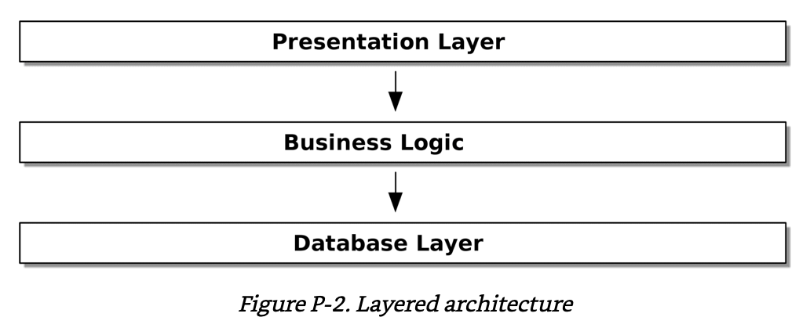

*Layered architectures are one way of tackling this problem.* In a layered architecture, we divide our code into discrete categories or roles, and we introduce rules about which categories of code can call each other.

### The Dependency Inversion Principle

Dependency Inversion Principle(DIP):

- High-level modules should not depend on low-level modules. Both should depend on abstractions.
- Abstractions should not depend on details. Instead, details should depend on abstractions.

High-level modules are the code that your organization really cares about. The high-level modules of a software system are the functions, classes, and packages that deal with our real-world concepts.

By contrast, low-level modules are the code that your organization doesn’t care about. It’s not often that you discuss SMTP, HTTP,
or AMQP with your finance team. For our nontechnical stakeholders, these
low-level concepts aren’t interesting or relevant.

> Depends on doesn’t mean imports or calls, necessarily, but rather a more general idea that one module knows about or needs another module.

So the first part of the DIP says that our business code shouldn’t depend on technical details; instead, both should use abstractions. Broadly, because we want to be able to change them independently of each
other.

*High-level modules should be easy to change in response to business needs. Low-level modules (details) are often, in practice, harder to
change*: think about refactoring to change a function name versus defining, testing, and deploying a database migration to change a column name.

**Adding an abstraction between them(the famous extra layer of indirection) allows the two to change more independently of each other.**

## Part I. Building an Architecture to Support Domain Modeling

We’ve found that many developers, when asked to design a new system, will immediately start to build a database schema, with the object model treated as an afterthought. *This is where it all starts to go wrong.*

**Instead, behavior should come first and drive our storage requirements.** After all, our customers don’t care about the data model. They care about what the system does; otherwise they’d just use a spreadsheet.

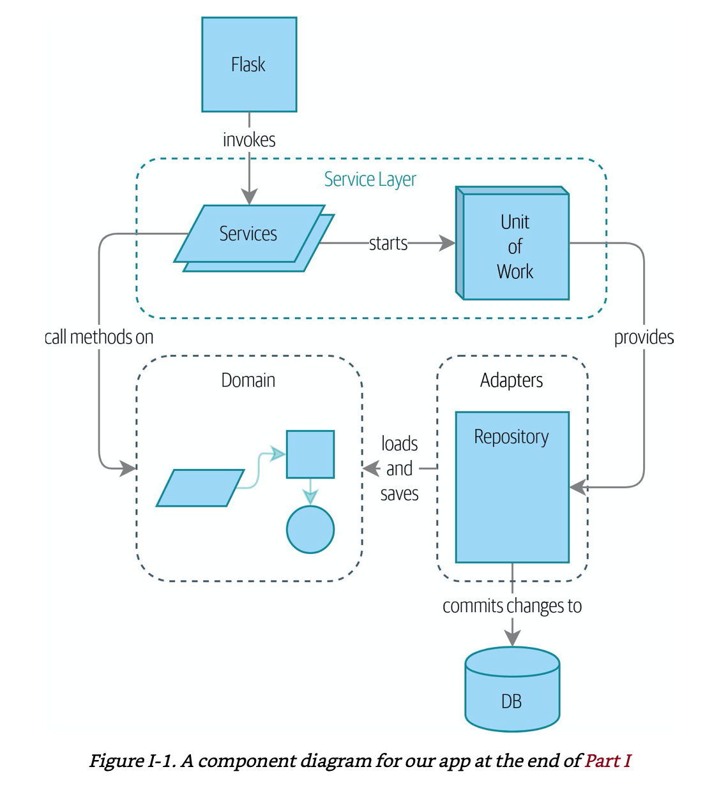

To do that, we present four key design patterns:

- **The Repository pattern**, an abstraction over the idea of persistent storage
- **The Service Layer pattern** to clearly define where our use cases begin and end
- **The Unit of Work pattern** to provide atomic operations
- **The Aggregate pattern** to enforce the integrity of our data

### Chapter 1. Domain Modeling

#### What Is a Domain Model

In the introduction, we used the term business logic layer to describe the central layer of a three-layered architecture. *For the rest of the book, we’re going to use the term **domain model** instead.*

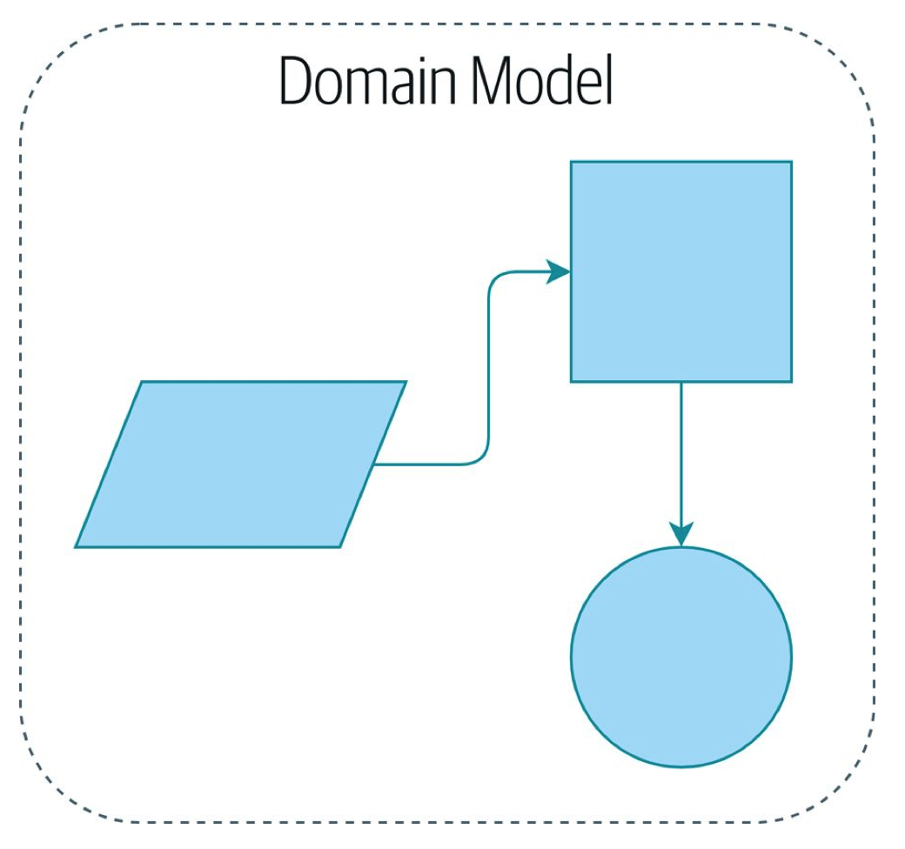

A domain is a fancy way of saying the problem you’re trying to solve. A model is a map of a process or phenomenon that captures a useful property. *The domain model is the mental map that business owners have of their businesses.*

#### Dataclasses Are Great for Value Objects

Whenever we have a business concept that has data but no identity, we
often choose to represent it using the **Value Object pattern**. *A value object is any domain object that is uniquely identified by the data it holds*; we usually make them *immutable*.

#### Value Objects and Entities

**A value object** is any object that is identified only by its data and doesn’t have a long-lived identity. One of the nice things that dataclasses (or namedtuples) give us is *value equality*, which is the fancy way of saying, "Two lines with the same orderid, sku, and qty are equal."

We use the term **entity** to describe a domain object, which is identified by a reference, that has long-lived identity. *Entities, unlike values, have identity equality.* We can change their values,
and they are still recognizably the same thing.

For value objects, the hash should be based on all the value attributes, and we should ensure that the objects are immutable.

For entities, the simplest option is to say that the hash is `None` , meaning that the object is not hashable and cannot, for example, be used in a set. If for some reason you decide you really do want to use set or dict operations with entities, the hash should be based on the attribute(s), such as `.reference`, that defines the entity’s unique identity over time. You should also try to somehow make that attribute read-only.

### Chapter 2. Repository Pattern

The Repository pattern, a simplifying abstraction over data storage, allows us to decouple our model layer from the data layer.

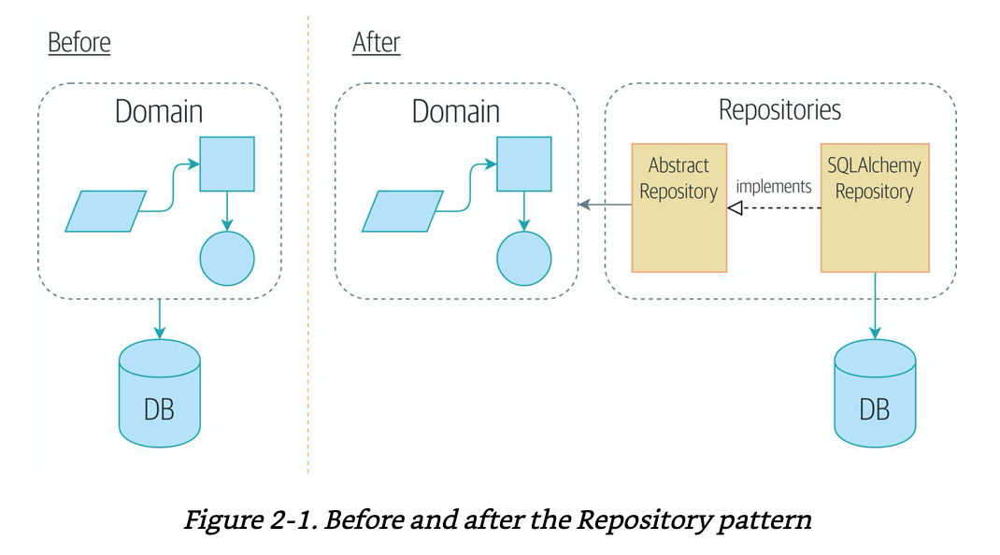

#### Applying the DIP to Data Access

We don’t want infrastructure concerns bleeding over into our domain model and slowing our unit tests or our ability to make changes. Instead, as discussed in the introduction, we’ll think of our model as being on the "inside", and dependencies flowing inward to it; this is what people sometimes call *onion architecture*.

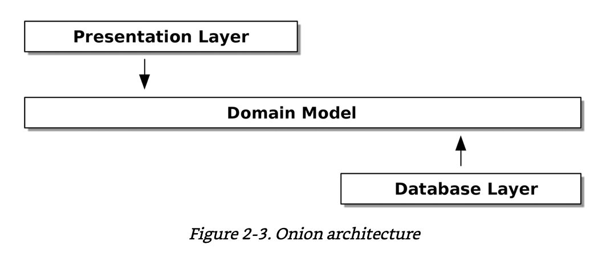

#### The "Normal" ORM Way: Model Depends on ORM

The most important thing an ORM gives us is *persistence ignorance* : the idea that our fancy domain model doesn’t need to know anything about how data is loaded or persisted. This helps keep our domain clean of direct dependencies on particular database technologies.

But if you follow the typical SQLAlchemy tutorial, you’ll end up with something like this:

> Our model classes inherit directly from ORM classes, so our model depends on the ORM. We want it to be the other way around.

#### Inverting the Dependency: ORM Depends on Model

The alternative is to define your schema separately, and to define an explicit mapper for how to convert between the schema and our domain model, what SQLAlchemy calls a *classical mapping*.

The objective of inverting the traditional dependency:

The domain model stays “pure” and free from infrastructure concerns. We could throw away SQLAlchemy and use a different ORM, or a totally
different persistence system, and the domain model doesn’t need to change at all.

#### Introducing the Repository Pattern

The Repository pattern is an abstraction over persistent storage. It hides the boring details of data access by pretending that all of our data is in memory.

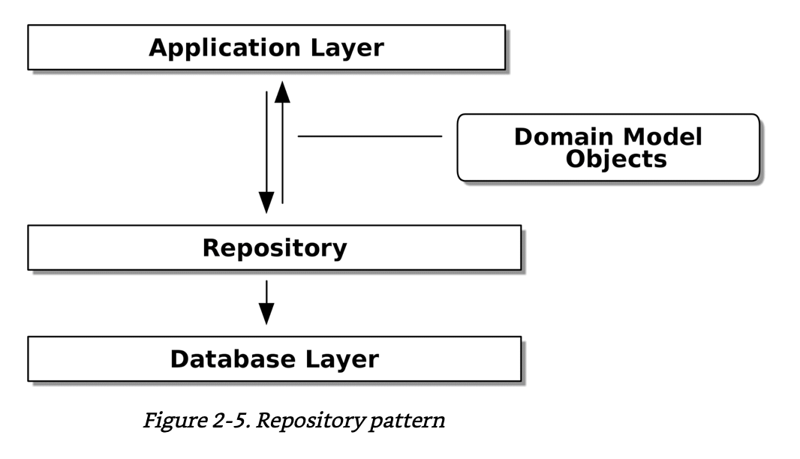

The simplest repository has just two methods: `add()` to put a new item in the repository, and `get()` to return a previously added item.

```python
class AbstractRepository(abc.ABC):
    @abc.abstractmethod
    def add(self, batch: model.Batch):
        raise NotImplementedError

    @abc.abstractmethod
    def get(self, reference) -> model.Batch:
        raise NotImplementedError
```

#### What Is a Port and What Is an Adapter, in Python

*Port* is the interface between our application and whatever it is we wish to abstract away, and the *adapter* is the implementation behind that interface or abstraction.

> Duck typing is a concept related to dynamic typing, where the type or the class of an object is less important than the methods it defines. When you use duck typing, you do not check types at all. Instead, you check for the presence of a given method or attribute.

### Chapter 3. A Brief Interlude: On Coupling and Abstractions

When we’re unable to change component A for fear of breaking component B, we say that the components have become *coupled*.

*Locally, coupling is a good thing*: it’s a sign that our code is working together, each component supporting the others, all of them fitting in place like the gears of a watch. In jargon, we say this works when there is *high cohesion* between the coupled elements.

*Globally, coupling is a nuisance*: it increases the risk and the cost of changing our code, sometimes to the point where we feel unable to make any changes at
all.

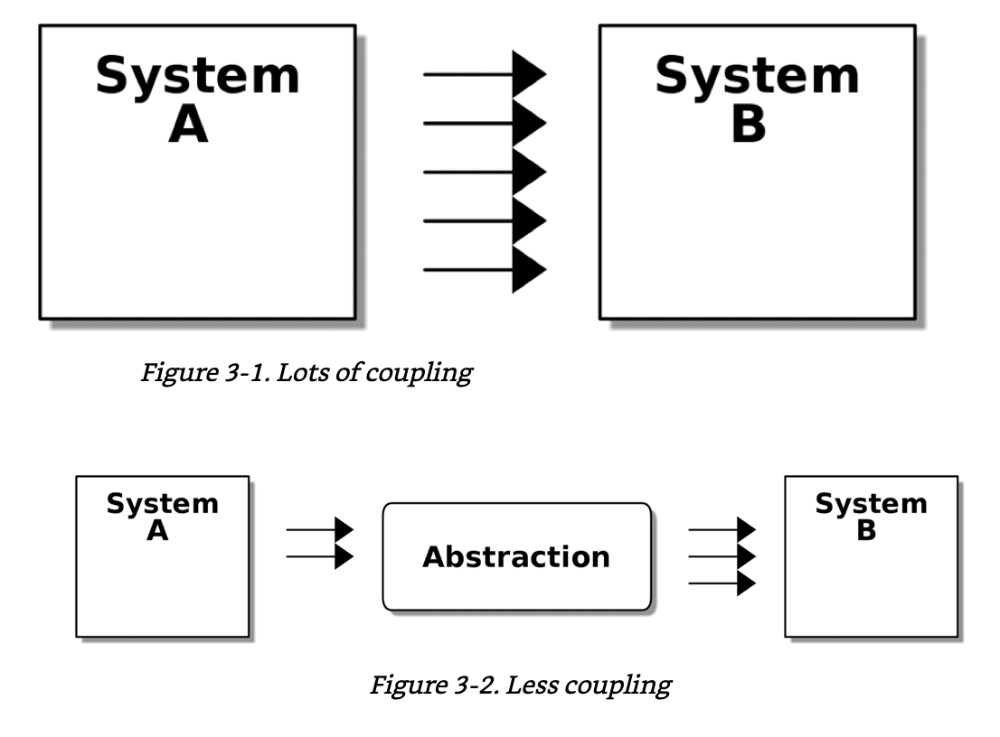

We can reduce the degree of coupling within a system by abstracting away the details.

#### Mocks Versus Fakes; Classic-Style Versus London-School TDD

Mocks are used to verify how something gets used; they have methods like `assert_called_once_with()`. They’re associated with London-school TDD.

Fakes are working implementations of the thing they’re replacing, but they’re designed for use only in tests. They wouldn’t work “in real life”; They’re associated with classic-style TDD.

More Read:

- [Mocks aren't Stubs](https://martinfowler.com/articles/mocksArentStubs.html)
- [London school TDD vs Classic TDD](https://softwareengineering.stackexchange.com/questions/123627/what-are-the-london-and-chicago-schools-of-tdd)
- [Test Driven Development](https://www.youtube.com/watch?v=B48Exq57Zg8)
- [Mocking and Patching Pitfalls](https://www.youtube.com/watch?v=Ldlz4V-UCFw)
- [Hoist your I/O](https://www.youtube.com/watch?v=PBQN62oUnN8)

### Chapter 4. Our First Use Case: Flask API and Service Layer

In this chapter, we discuss the differences between orchestration logic, business logic, and interfacing code, and we introduce the *Service Layer* pattern to take care of orchestrating our workflows and defining the use cases of our system.

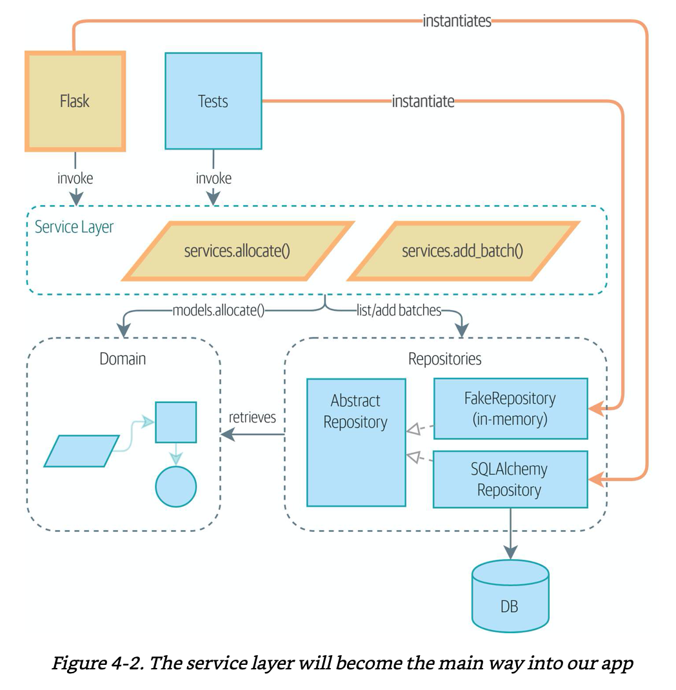

Because our service layer depends on the `AbstractRepository`, we can unit test it by using `FakeRepository`, but run our production code using `SqlAlchemyRepository`.

#### Introducing a Service Layer, and Using FakeRepository to Unit Test It

If we look at what our Flask app is doing, there’s quite a lot of what we might call *orchestration*:

- Fetching stuff out of our repository
- Validating our input against database state
- Handling errors
- Committing in the happy path

Most of these things don’t have anything to do with having a
web API endpoint, and they’re not really things that need to be tested by end-to-end tests.

It often makes sense to split out a *service layer*, sometimes called an
*orchestration* layer or a *use-case layer*.

#### A Typical Service Function

Typical service-layer functions have similar steps:

1. We fetch some objects from the repository.
2. We make some checks or assertions about the request against the current state of the world.
3. We call a domain service.
4. If all is well, we save/update any state we’ve changed.

The responsibilities of the Flask app are just standard web stuff:

- Per-request session management
- Parsing information out of POST parameters
- Response status codes, and JSON

All the orchestration logic is in the use case/service layer, and the domain logic stays in the domain.

#### Why Is Everything Called a Service

We’re using two things called a service in this chapter.

The first is an *application service(our service layer)*. Its job is to handle requests from the outside world and to orchestrate an operation. What we mean is that the service layer drives the application by following a bunch of simple steps:

1. Get some data from the database
2. Update the domain model
3. Persist any changes

This is the kind of boring work that has to happen for every operation in your system, and keeping it separate from business logic helps to keep things tidy.

The second type of service is a *domain service*. This is the name for a piece of logic that belongs in the domain model but doesn’t sit naturally inside a stateful entity or value object.

#### The DIP in Action

Figure 4-3 shows the dependencies of our service layer: the domain model
and AbstractRepository(the port, in ports and adapters terminology).

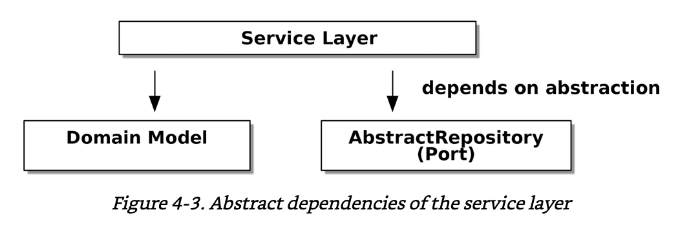

When we run the tests, Figure 4-4 shows how we implement the abstract dependencies by using FakeRepository(the adapter).


And when we actually run our app, we swap in the "real" dependency shown in Figure 4-5.

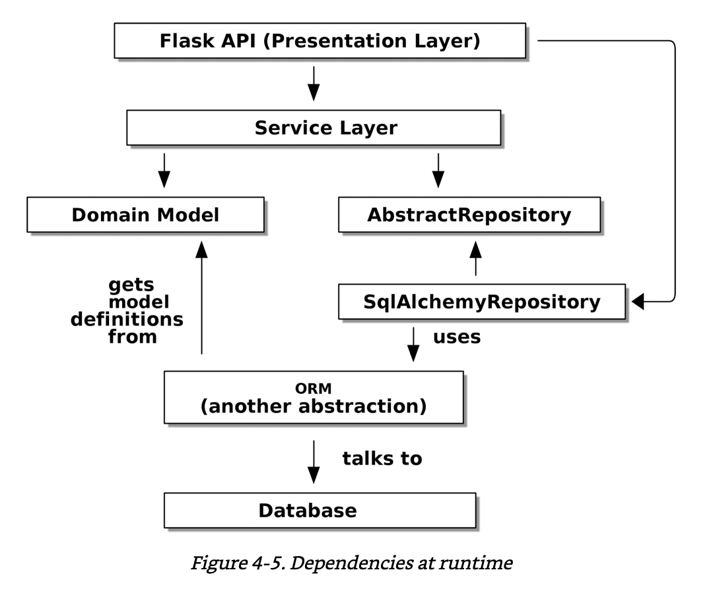

### Chapter 5. TDD in High Gear and Low Gear

#### Should Domain Layer Tests Move to the Service Layer

Tests are supposed to help us change our system fearlessly, but often
we see teams writing too many tests against their domain model. This causes problems when they come to change their codebase and find that they need to update tens or even hundreds of unit tests.

#### On Deciding What Kind of Tests to Write

You might be asking yourself, "Should I rewrite all my unit tests, then? Is it wrong to write tests against the domain model?” To answer those questions, it’s important to understand the trade-off between coupling and design feedback.

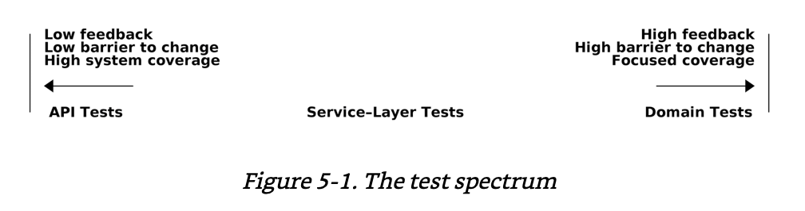

A test for the HTTP API tells us nothing about the fine-grained design of our objects, because it sits at a much higher level of abstraction. On the other hand, we can rewrite our entire application and, so long as we don’t change the URLs or request formats, our HTTP tests will continue to pass. This gives us confidence that large-scale changes, like changing the database schema, haven’t broken our code.

At the other end of the spectrum, the tests we wrote in *Chapter 1* helped us to flesh out our understanding of the objects we need. The tests guided us to a design that makes sense and reads in the domain language. Because the tests are written in the domain language, they act as living documentation for our model.

#### High and Low Gear

Most of the time, when we are adding a new feature or fixing a bug, we don’t need to make extensive changes to the domain model. In these cases, we prefer to write tests against services because of the lower coupling and higher coverage.

When starting a new project or when hitting a particularly gnarly problem, we will drop back down to writing tests against the domain model so we get better feedback and executable documentation of our intent.

The metaphor we use is that of shifting gears. When starting a journey, the bicycle needs to be in a low gear so that it can overcome inertia. Once we’re off and running, we can go faster and more efficiently by changing into a high gear; but if we suddenly encounter a steep hill or are forced to slow down by a hazard, we again drop down to a low gear until we can pick up speed again.

#### Rules of Thumb for Different Types of Test

##### 1. Aim for one end-to-end test per feature

This might be written against an HTTP API, for example. The objective
is to demonstrate that the feature works, and that all the moving parts
are glued together correctly.

##### 2. Write the bulk of your tests against the service layer

These edge-to-edge tests offer a good trade-off between coverage, runtime, and efficiency. Each test tends to cover one code path of a
feature and use fakes for I/O. This is the place to exhaustively cover all the edge cases and the ins and outs of your business logic.

##### 3. Maintain a small core of tests written against your domain model

These tests have highly focused coverage and are more brittle, but they have the highest feedback. Don’t be afraid to delete these tests if the functionality is later covered by tests at the service layer.

##### 4. Error handling counts as a feature

Ideally, your application will be structured such that all errors that bubble up to your entrypoints (e.g., Flask) are handled in the same way. This means you need to test only the happy path for each feature, and to reserve one end-to-end test for all unhappy paths (and many unhappy path unit tests, of course).

### Chapter 6. Unit of Work Pattern

If the **Repository pattern** is our abstraction over the idea of *persistent storage*, the **Unit of Work(UoW) pattern** is our abstraction over the idea of *atomic operations*.

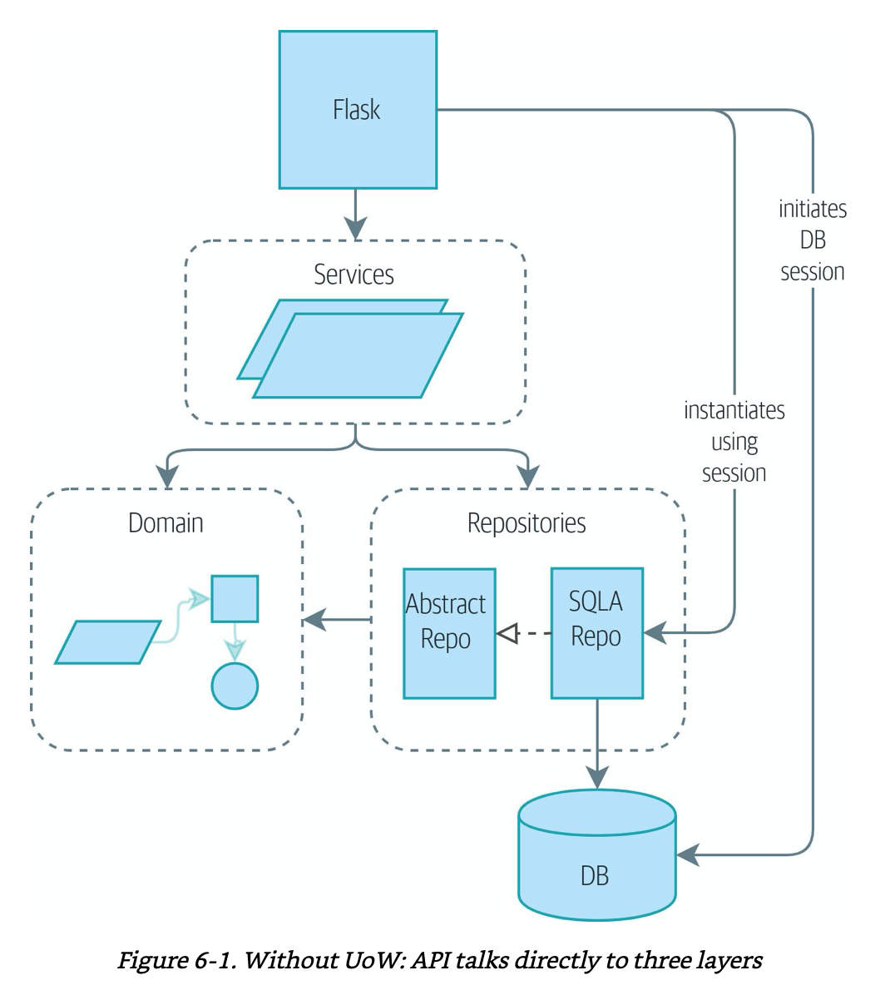

Figure 6-1 shows that, currently, a lot of communication occurs across the layers of our infrastructure:

- The API talks directly to the database layer to start a session
- It talks to the repository layer to initialize `SQLAlchemyRepository`
- It talks to the service layer to ask it to allocate


Figure 6-2 shows our target state. The Flask API now does only two
things:

- It initializes a unit of work, and it invokes a service
- The service collaborates with the UoW

But neither the service function itself nor Flask now needs
to talk directly to the database.

#### The Unit of Work Collaborates with the Repository

The UoW acts as a single entrypoint to our persistent storage, and it
keeps track of what objects were loaded and of the latest state. This gives us three useful things:

1. A stable snapshot of the database to work with, so the objects we use aren’t changing halfway through an operation
2. A way to persist all of our changes at once, so if something goes wrong, we don’t end up in an inconsistent state
3. A simple API to our persistence concerns and a handy place to get a repository

#### Don’t Mock What You Don’t Own

The problem is that `Session` is a complex object that exposes lots of persistence-related functionality. It’s easy to use `Session` to make arbitrary queries against the database, but that quickly leads to data access code being sprinkled all over the codebase. To avoid that, we want to limit access to our persistence layer so each component has exactly what it needs and nothing more.

*“Don’t mock what you don’t own”* is a rule of thumb that forces us to build these simple abstractions over messy subsystems. This has the same performance benefit as mocking the SQLAlchemy session but encourages us to think carefully about our designs.

#### Unit of Work Pattern Recap

##### The Unit of Work pattern is an abstraction around data integrity

It helps to enforce the consistency of our domain model, and improves performance, by letting us perform a single flush operation at the
end of an operation.

##### It works closely with the Repository and Service Layer patterns

The Unit of Work pattern completes our abstractions over data access by
representing atomic updates. Each of our service-layer use cases runs in a single unit of work that succeeds or fails as a block.

##### This is a lovely case for a context manager

Context managers are an idiomatic way of defining scope in Python. We can use a context manager to automatically roll back our work at the end of a request, which means the system is safe by default.

##### SQLAlchemy already implements this pattern

We introduce an even simpler abstraction over the SQLAlchemy Session object in order to “narrow” the interface between the ORM and our code. This helps to keep us loosely coupled.

### Chapter 7. Aggregates and Consistency Boundaries

In this chapter, we’d like to revisit our domain model to talk about ***invariants*** and ***constraints***, and see how our domain objects can maintain their own internal consistency, both conceptually and in persistent storage.

We’ll discuss the concept of a ***consistency boundary*** and show how making it explicit can help us to build high-performance software without compromising maintainability.

#### Invariants, Constraints, and Consistency

The two words are somewhat interchangeable, but a *constraint* is a rule that restricts the possible states our model can get into, while an *invariant* is defined a little more precisely as a condition that is always true.

If we were writing a hotel-booking system, we might have the *constraint* that double bookings are not allowed. This supports the *invariant* that a room cannot have more than one booking for the same night.

#### Invariants, Concurrency, and Locks

In a single-threaded, single-user application, it’s relatively easy for us to maintain this invariant. We can just allocate stock one line at a time, and raise an error if there’s no stock available. *This gets much harder when we introduce the idea of concurrency.*

*We usually solve this problem by applying **locks** to our database tables*. This prevents two operations from happening simultaneously on the same row or same table. As we start to think about scaling up our app, we realize that our model of allocating lines against all available batches may not scale. *We’ll get **deadlocks** or performance problems at the very least.*

#### What Is an Aggregate

We want to protect the invariants of our system but allow for the greatest degree of concurrency.

The **Aggregate pattern** is a design pattern from the DDD community that helps us to resolve this tension. An aggregate is just a domain object that contains other domain objects and lets us treat the whole collection as a single unit. *The only way to modify the objects inside the aggregate is to load the whole thing, and to call methods on the aggregate itself.*

Especially when we have collections in the model as we do (our batches are a collection), it’s a good idea to nominate some entities to be the single entrypoint for modifying their related objects.

> An AGGREGATE is a cluster of associated objects that we treat as a unit for the purpose of data changes. (Eric Evans, Domain-Driven Design blue book)

#### Choosing an Aggregate

The aggregate will be the boundary where we make sure every operation ends in a consistent state.  We want to draw a boundary around a small number of objects - the smaller, the better for performance that have to be consistent with one another.

#### Aggregates, Bounded Contexts, and Microservices

One of the most important contributions from Evans and the DDD community
is the concept of [bounded contexts](https://martinfowler.com/bliki/BoundedContext.html).

In essence, this was a reaction against attempts to capture entire businesses into a single model. The word customer means different things to people in sales, customer service, logistics, support, and so on.

Rather than trying to build a single model (or class, or database) to capture all the use cases, it’s better to have several models, draw boundaries around each context, and handle the translation between different contexts explicitly.

This concept translates very well to the world of microservices, where each microservice is free to have its own concept of “customer”. Whether or not you have a microservices architecture, a key consideration in choosing your aggregates is also choosing the bounded context that they will operate in.

#### One Aggregate = One Repository

Once you define certain entities to be aggregates, we need to apply the rule that they are the only entities that are publicly accessible to the outside world. *In other words, the only repositories we are allowed should be repositories that return aggregates.*

#### Optimistic Concurrency with Version Numbers

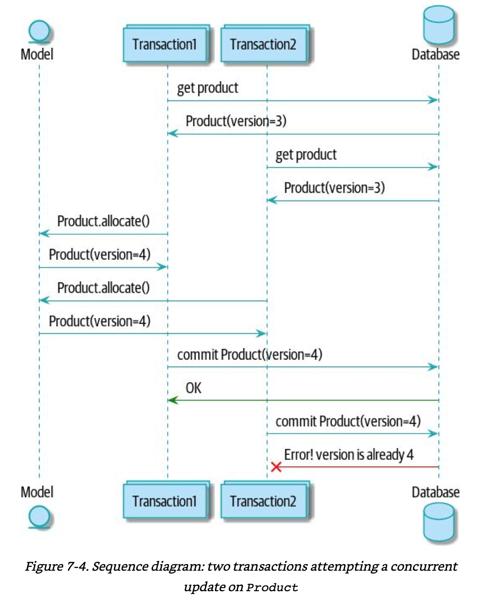

What we’ve implemented here is called ***optimistic concurrency control*** because our default assumption is that everything will be fine when two users want to make changes to the database. We think it’s unlikely that they will conflict with each other, so we let them go ahead and just make sure we have a way to notice if there is a problem.

***Pessimistic concurrency control*** works under the assumption that two users are going to cause conflicts, and we want to prevent conflicts in all cases, so we lock everything just to be safe. In our example, that would mean locking the whole batches table, or using `SELECT FOR UPDATE` we’re pretending that we’ve ruled those out for performance reasons, but *in real life you’d want to do some evaluations and measurements of your own.*

With pessimistic locking, you don’t need to think about handling failures because the database will prevent them for you (although you do need to think about deadlocks). With optimistic locking, you need to explicitly handle the possibility of failures in the (hopefully unlikely) case of a clash.

Read more: [PostgreSQL anti-patterns: read-modify-write cycles](https://www.2ndquadrant.com/en/blog/postgresql-anti-patterns-read-modify-write-cycles/)
