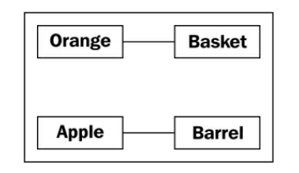
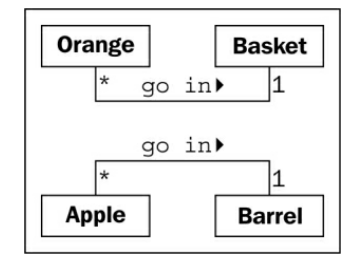
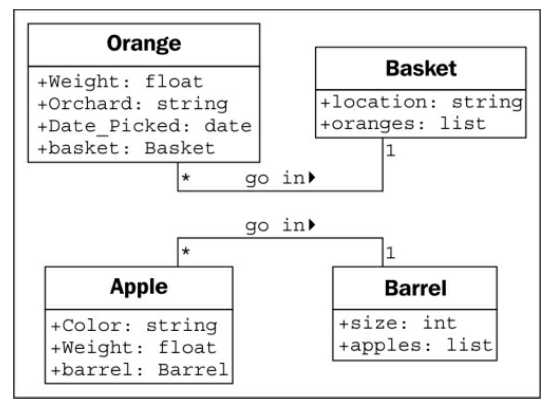
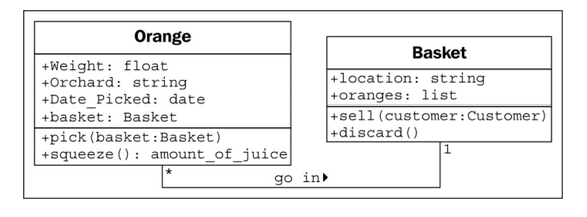
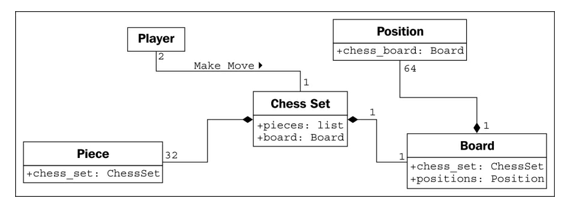
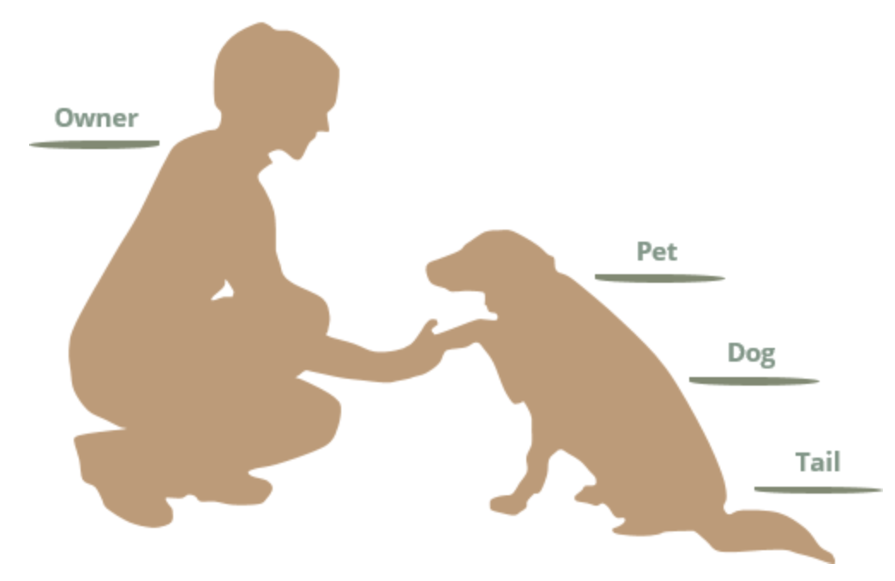
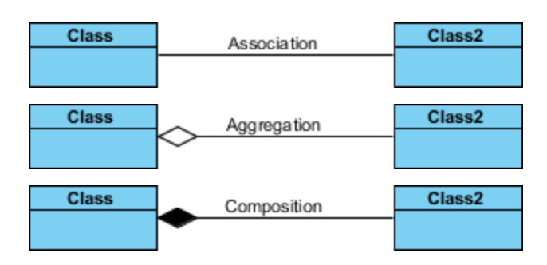
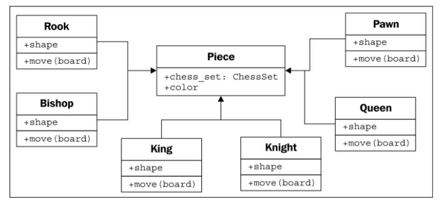
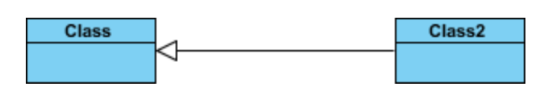
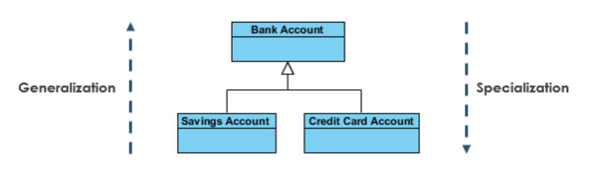

# Chapter 1. Object-oriented Design

In this chapter, we will cover the following topics:

- What object-oriented means
- The difference between object-oriented design and object-oriented programming
- The basic principles of an object-oriented design
- **Basic Unified Modeling Language**(**UML**) and when it isn't evil

## Introducing object-oriented

Software objects are not typically tangible things that you can pick up, sense, or feel, but they are models of something that can do certain things and have certain things done to them. *Formally, an object is a collection of **data** and associated **behaviors**.*

*Object-oriented means functionally directed towards modeling objects.* This is one of the many techniques used for modeling complex systems by describing a collection of interacting objects via their data and behavior.

**Object-oriented analysis(OOA)** is the process of looking at a problem, system, or task (that somebody wants to turn into an application) and identifying the objects and interactions between those objects. *The analysis stage is all about **WHAT** needs to be done.* The output of the analysis stage is **a set of requirements**. For example, Website visitors need to be able to:

- *review* our **history**
- *apply* for **jobs**
- *browse*, *compare*, and *order* **products**

**Object-oriented design (OOD)** is the process of converting such requirements into **an implementation specification**. The designer must name the objects, define the behaviors, and formally specify which objects can activate specific behaviors on other objects. *The design stage is all about **HOW** things should be done.*

**Object-oriented programming (OOP)** is the process of converting this perfectly defined design into a working program

## Objects and classes

In object-oriented modeling, the term used for *kind of object* is **class**. Classes describe objects. They are like blueprints for creating an object. The relationship between the four classes of objects in our inventory system can be described using a **Unified Modeling Language (UML)**

This diagram shows that an **Orange** is somehow associated with a **Basket** and that an **Apple** is also somehow associated with a **Barrel**. Association is the most basic way for two classes to be related.

One **Basket** can hold many (represented by a *) **Orange** objects. Any one **Orange** can go in exactly one **Basket**. Many instances of the **Apple** class (that is many **Apple** objects) can go in any one **Barrel**. Exactly one **Barrel** can be associated with any one **Apple**.

> This number is referred to as the multiplicity of the object. You may also hear it described as the cardinality. These are actually slightly distinct terms. **Cardinality** refers to the actual number of items in the set, whereas **multiplicity** specifies how small or how large this number could be.

## Specifying attributes and behaviors

Objects are instances of classes that can be associated with each other. An object instance is a specific object with its own set of data and behaviors.

### Data describes objects

Data typically represents the individual characteristics of a certain object. A class can define specific sets of characteristics that are shared by all objects of that class. Any specific object can have different data values for the given characteristics:

- The **Orange** class could then have a weight **attribute**.

Attributes are frequently referred to as **members** or **properties**.

Depending on how detailed our design needs to be, we can also specify the type for each attribute. Usually, we don't need to be overly concerned with data types at the design stage, as implementation-specific details are chosen during the programming stage. Generic names are normally sufficient for design.

### Behaviors are actions

Behaviors are actions that can occur on an object. The behaviors that can be performed on a specific class of objects are called methods.

Like functions, methods can also accept **parameters** and return **values**. Parameters to a method are a list of objects that need to be *passed* into the method that is being called (the objects that are passed in from the calling object are usually referred to as **arguments**).

Adding models and methods to individual objects allows us to create a system of interacting objects. Each object in the system is a member of a certain class. These classes specify what types of data the object can hold and what methods can be invoked on it.

## Hiding details and creating the public interface

The key purpose of modeling an object in object-oriented design is to determine what the public **interface** of that object will be. The interface is the collection of attributes and methods that other objects can use to interact with that object.

This process of hiding the implementation, or functional details, of an object is suitably called **information hiding**. It is also sometimes referred to as **encapsulation**, *but encapsulation is actually a more all-encompassing term.*

The public interface is very important. *It needs to be carefully designed as it is **difficult to change** it in the future.* Always design the interface of an object based on how easy it is to use, not how hard it is to code (this advice applies to user interfaces as well).

Remember, program objects may represent real objects, but that does not make them real objects. They are models. One of the greatest gifts of modeling is the ability to ignore irrelevant details. The model is an **abstraction** of a real concept.

> Abstraction is the process of encapsulating information with separate public and private interfaces. The private interfaces can be subject to information hiding.

**Don't try to model objects or actions that *might* be useful in the future.** This is not to say we should not think about possible future design modifications. Our designs should be open ended so that future requirements can be satisfied. However, when abstracting interfaces, try to model exactly what needs to be modeled and nothing more. When designing the interface, try placing yourself in the object's shoes and imagine that *the object has a strong preference for privacy.*

## Composition

Most design patterns rely on two basic object-oriented principles known as composition and inheritance.

Composition is the act of collecting several objects together to create a new one. Composition is usually a good choice when one object is part of another object:

- A car is composed of an engine, transmission, starter, headlights, and windshield, among numerous other parts.

**Aggregation** is almost exactly like composition. The difference is that aggregate objects can exist independently:

- It would be impossible for a position to be associated with a different chess board, so we say the board is composed of positions.
- But the pieces, which might exist independently of the chess set, are said to be in an aggregate relationship with that set.

Another way to differentiate between aggregation and composition is to think about the *lifespan of the object*. If the composite (outside) object controls when the related (inside) objects are created and destroyed, composition is most suitable.

Composition is aggregation, aggregation is simply a more general form of composition. Any composite relationship is also an aggregate relationship, but not vice versa.

The composition relationship is represented in UML as a solid diamond. The hollow diamond represents the aggregate relationship.

### Association vs Aggregation vs Composition

We see the following relationships:

- Owners feed pets, pets please owners (**association**)
- A tail is a part of both dogs and cats (**aggregation** / **composition**)
- A cat is a kind of pet (**inheritance** / **generalization**)

> UML: Association vs Aggregation vs Composition
> 

If two classes in a model need to communicate with each other, there must be a link between them, and that can be represented by an **association** (connector).

**Aggregation** and **Composition** are subsets of **association** meaning they are specific cases of association. In both aggregation and composition object of one class "owns" object of another class. But there is a subtle difference:

- **Aggregation** implies a relationship where the child can exist independently of the parent.
  - Example: Class(parent) and Student(child). Delete the Class and the Students still exist.
- **Composition** implies a relationship where the child cannot exist independent of the parent.
  - Example: House(parent) and Room(child). Rooms don't exist separate to a House.

## Inheritance

The *is a* relationship is formed by **inheritance**. In object-oriented programming, one class can inherit attributes and methods from another class.

In the case of chess pieces, it doesn't really make sense to provide a default implementation of the move method. All we need to do is specify that the move method is required in any subclasses. This can be done by making **Piece** an **abstract class** with the move method declared **abstract**. Abstract methods basically say, "We demand this method exist in any non-abstract subclass, but we are declining to specify an implementation in this class."

Indeed, it is possible to make a class that does not implement any methods at all. Such a class would simply tell us what the class should do, but provides absolutely no advice on how to do it. In object-oriented parlance, such classes are called **interfaces**.

### Inheritance provides abstraction

**Polymorphism** is the ability to treat a class differently depending on which subclass is implemented.

Polymorphism is pretty cool, but it is a word that is rarely used in Python programming. Python goes an extra step past allowing a subclass of an object to be treated like a parent class. A board implemented in Python could take any object that has a move method, whether it is a bishop piece, a car, or a duck. This sort of polymorphism in Python is typically referred to as **duck typing**: "If it walks like a duck or swims like a duck, it's a duck". We don't care if it really is a duck (inheritance), only that it swims or walks.

### Multiple inheritance

Object-oriented design can also feature such **multiple inheritance**, which allows a subclass to inherit functionality from multiple parent classes.

As long as two classes have distinct interfaces, it is not normally harmful for a subclass to inherit from both of them. However, it gets messy if we inherit from two classes that provide overlapping interfaces.

### Generalization vs Specialization

> UML: Generalization
> 

**Generalization** is a mechanism for combining similar classes of objects into a single, more general class. Generalization identifies commonalities among a set of entities. The commonality may be of attributes, behavior, or both. In other words, a superclass has the most general attributes, operations, and relationships that may be shared with subclasses. A subclass may have more specialized attributes and operations.

**Specialization** is the reverse process of Generalization means creating new sub-classes from an existing class.

### Generalization vs Inheritance

**Generalization** is the term that we use to denote abstraction of common properties into a base class in UML. The UML diagram's Generalization association is also known as **Inheritance**. When we implement Generalization in a programming language, it is often called Inheritance instead. Generalization and inheritance are the same. The terminology just differs depending on the context where it is being used.
