# Lesson 2-2. Interacting with Databases

## 1. Overview

### Interacting with a (remote) database

A Database Management System (DBMS) is simply software that allows you to interact with a database (e.g., to access or modify the data in that database).

### Database Application Programming Interfaces (DBAPIs)

Once we've looked at the basics of interacting with a database, we'll need to understand how to interface with that database from another language or web server framework (such as Python, NodeJS, Ruby on Rails, etc.). This is where DBAPIs come in.

## 2. Relational Databases

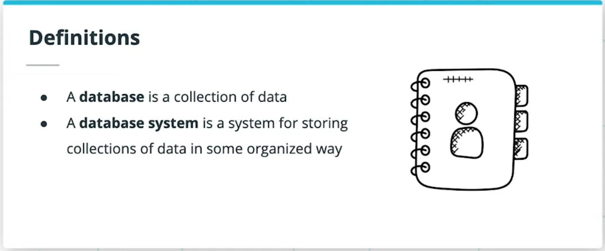
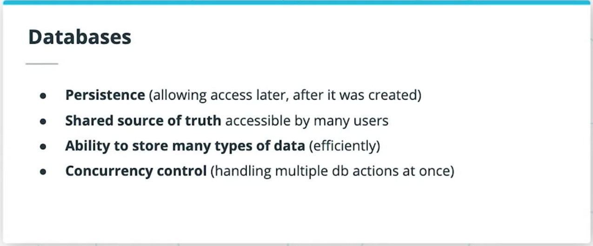
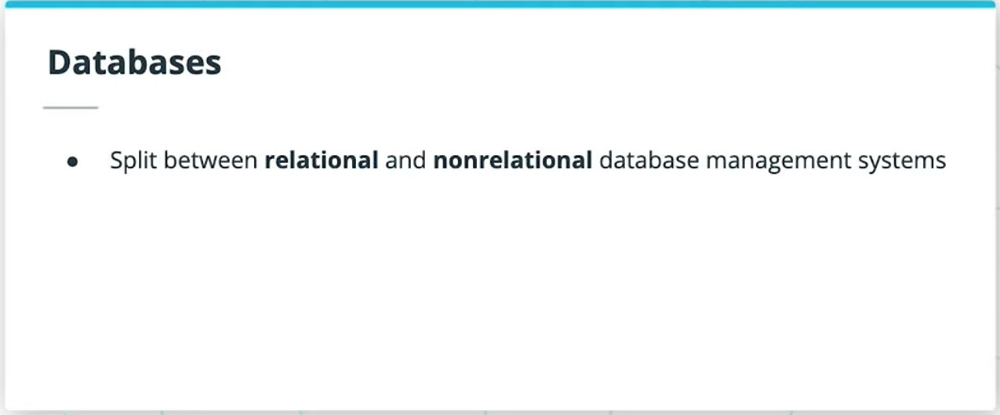
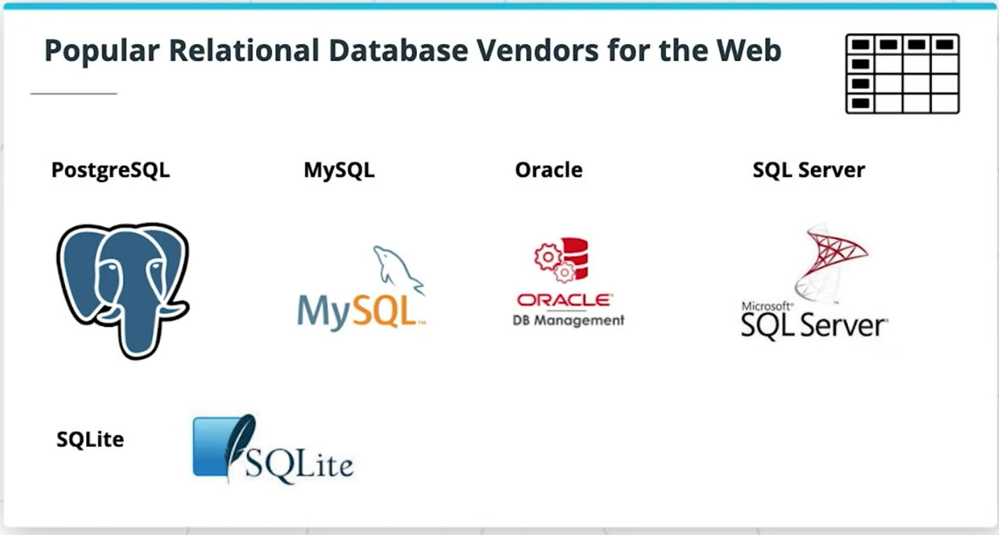
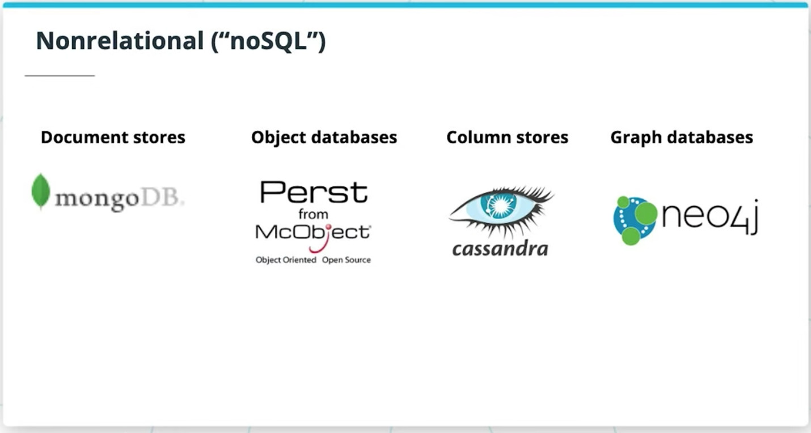
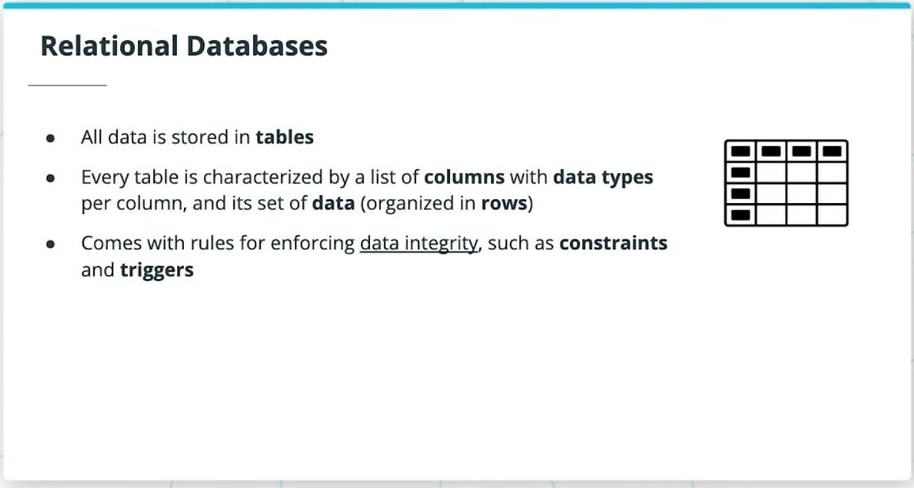

### 2. Resources

- [Udacity: Intro to Relational Databases](https://www.udacity.com/course/intro-to-relational-databases--ud197)
- [Youtube: An Introduction to Relational Databases](https://www.youtube.com/watch?v=z2kbsG8zsLM)

## 3. Primary Keys & Foreign Keys

**Primary Key**:

- The primary key is the *unique identifier* for the entire row, referring to one or more columns.
- If there are more multiple columns for the primary key, then the set of primary key columns is known as a **composite key**.

**Foreign Key**:

- A primary key in another (foreign) table.
- Foreign keys are used to map relationships between tables.

## 4. SQL

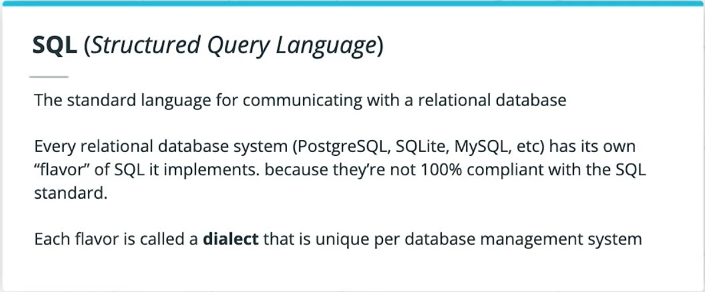
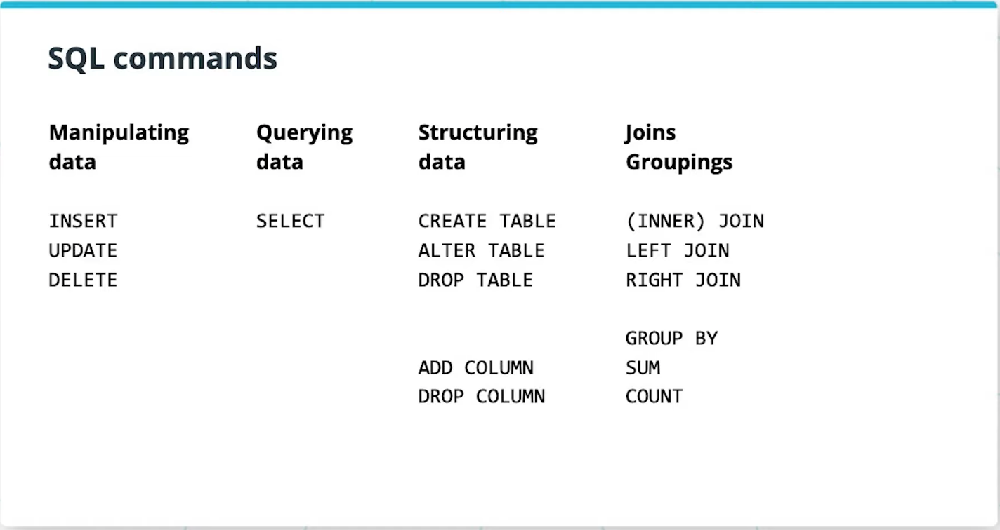

- [SQL Fiddle](http://sqlfiddle.com/)

## 5. Execution Plan

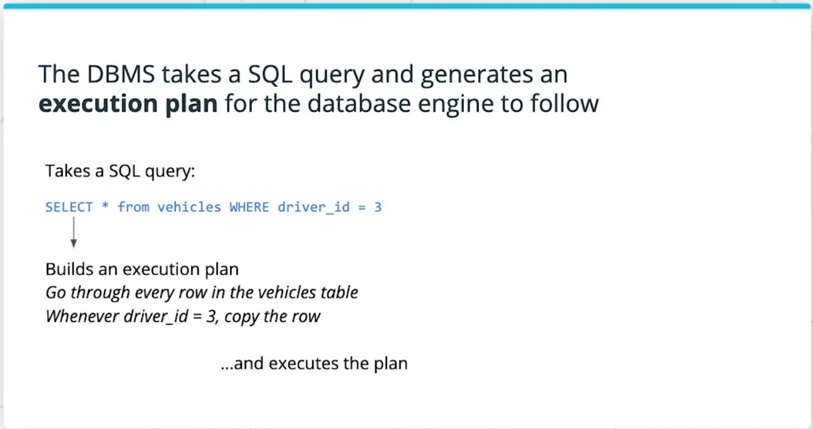

- [Explaining the unexplainable – part 2](https://www.depesz.com/2013/04/27/explaining-the-unexplainable-part-2/#seq-scan)

### On Performance

Learning how to write efficient queries is practically its own field. There are techniques for improving the performance of SQL queries to consider, we can use critical indexes to speed up information lookups, and there are helpful utilities like SQL views for splitting queries into subroutines.

- [Use the Index, Luke](https://use-the-index-luke.com/)

### 5. References

- [What is a HashTable Data Structure](https://www.youtube.com/watch?v=MfhjkfocRR0)
- [Intro to Hash tables](https://www.slideshare.net/AmyHua/intro-to-hash-tables)

## 6. Client-Server Model

A **server** is a centralized program that communicates over a network (such as the Internet) to serve clients. And a **client** is a program (like the web browser on your computer) that can request data from a server. Relational database systems follow a client-server model.

### Servers, Clients, Hosts

### Requests and Responses

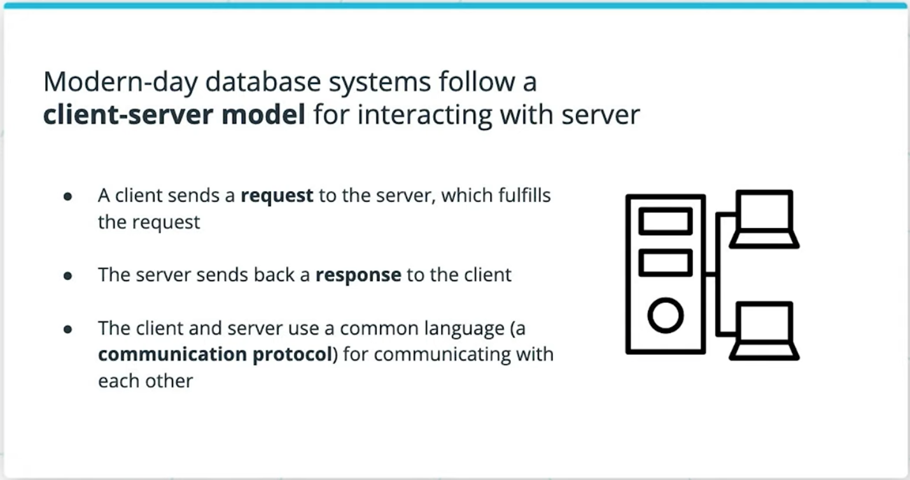

### Relational Database Clients

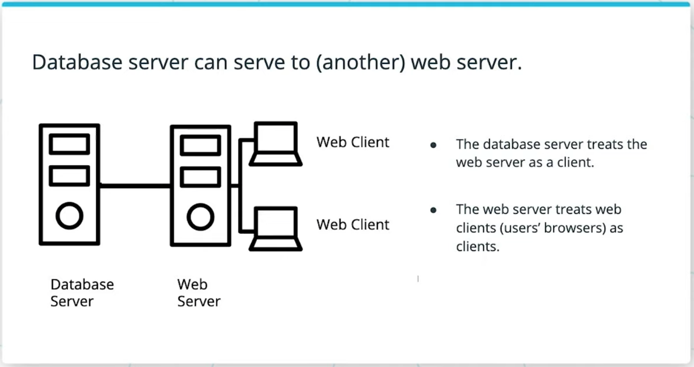

- A database client is any program that sends requests to a database
- In some cases, the database client is a web server.

## 7. TCP/IP

TCP/IP is a suite of communication protocols that is used to connect devices and transfer data over the Internet.

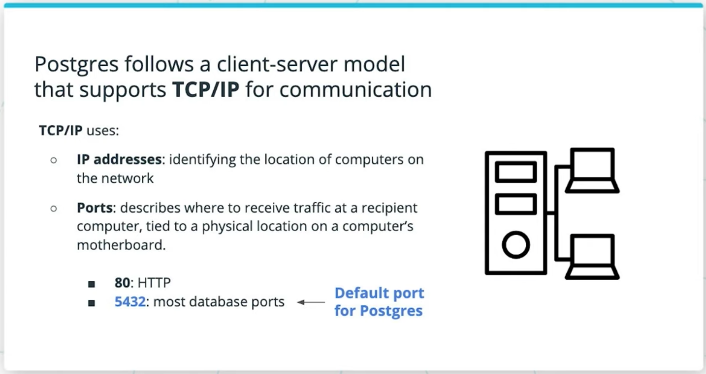

**TCP/IP uses**:

- IP addresses: An IP address identifies the location of a computer on a network.
- Ports: A port is a location on the recipient computer, where data is received.

### 7. References

[Udacity - Computer Networking](https://www.udacity.com/course/computer-networking--ud436)

## 8. Connections and Sessions in TCP/IP

TCP/IP is connection-based, meaning all communications between parties are arranged over a connection. A connection is established before any data transmission begins.

- Over TCP/IP, we'll always need to establish a connection between clients and servers in order to enable communications. Moreover:
- Deliveries over the connection are error-checked: if packets arrive damaged or lost, then they are resent (known as retransmission).

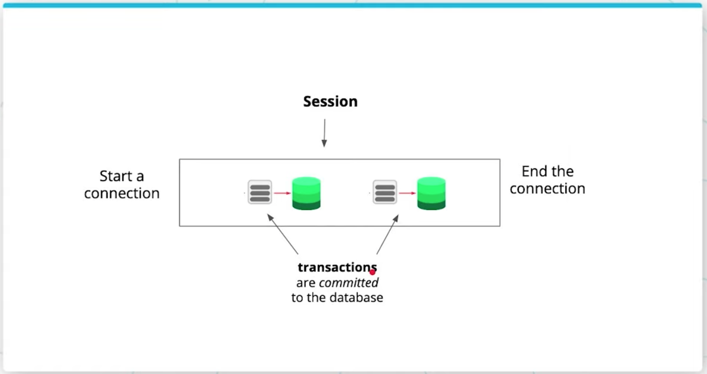

- Connecting starts a session. Ending the connection ends the session.
- In a database session, many transactions can occur during a given session. Each transaction does work to commit changes to the database (updating, inserting, or deleting records).

## 9. Transactions

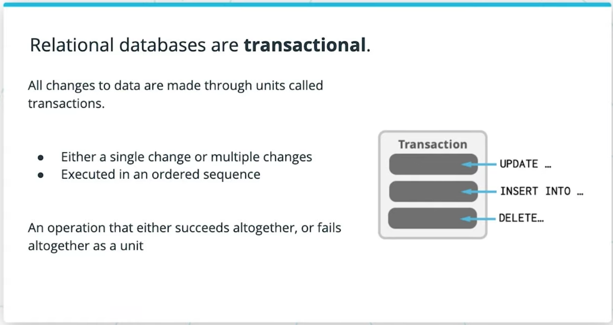

> Transactions capture logical bundles of work.

Work is bundled into transactions, so that in case of system failures, data in your database is still kept in a valid state (by rolling back the entire transaction if any part of it fails). To ensure a database is consistent before and after work is done to it, databases uses atomic transactions, and actions like commits and rollbacks to handle failures appropriately. Transactions are, in other words, [ACID](https://www.geeksforgeeks.org/acid-properties-in-dbms/).

## 12. Postgres Command Line Applications

| Command | Description |
| --- | --- |
| `$ sudo -u <username> -i` | log in as username. Default installed user is called postgres |
| `$ createdb <dbname>` | Create a database |
| `$ dropdb <dbname>` | Destroy a datbase |
| `$ dropdb <dbname> && createdb <dbname>` | Reset a database |

## 13. Intro to psql

| Command | Description |
| --- | --- |
| `$ psql <dbname> [<username>]` | Start psql with a connection to bname. Optionally use another user than current user |
| `# \l` | List all databases on the server, owners,access levels |
| `# \c <dbname>` | Connect to a database named |
| `# \dt` | Show database tables |
| `# \d <tablename>` | Describe table schema |
| `# \q` | Quit psql, return to the terminal |

## 15. Other Postgres Clients

- [pgAdmin](https://www.pgadmin.org/), available for every operating system
- [PopSQL](https://popsql.com/) available for MacOS

| Connection Setting | Default |
| --- | --- |
| Host | localhost (127.0.0.1) |
| Port | 5432 |
| Username | postgres |
| Password | None |

## 17. DBAPIs and psycopg2

**A DBAPI**:

- provides a standard interface for one programming language (like Python) to talk to a relational database server.
- Is a low level library for writing SQL statements that connect to a database
- is also known as database adapters

Different DBAPIs exist for every server framework or language + database system. Database adapters define a standard for using a database (with SQL) and using the results of database queries as input data in the given language. Turn a selected `SELECT * from some_table;` list of rows into an array of objects in Javascript for say a NodeJS adapter; or a list of tuples in Python for a Python adapter.
