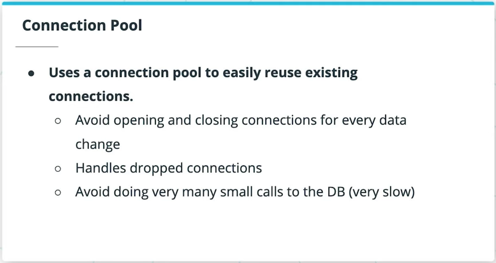
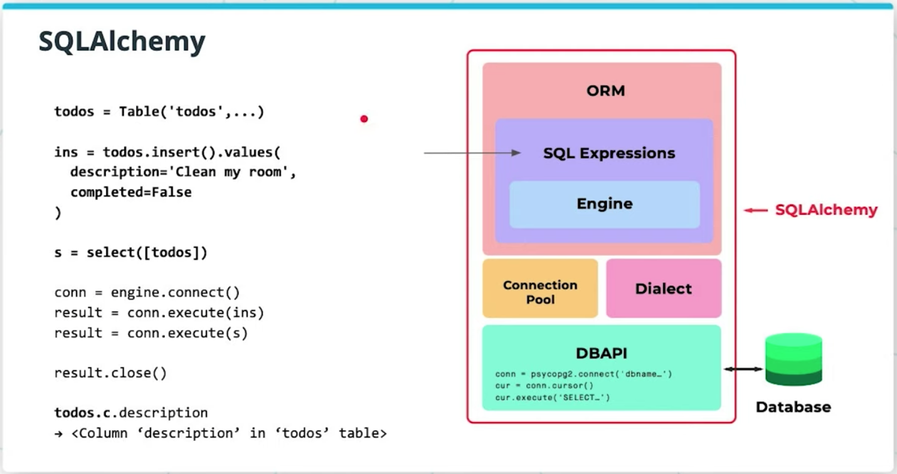
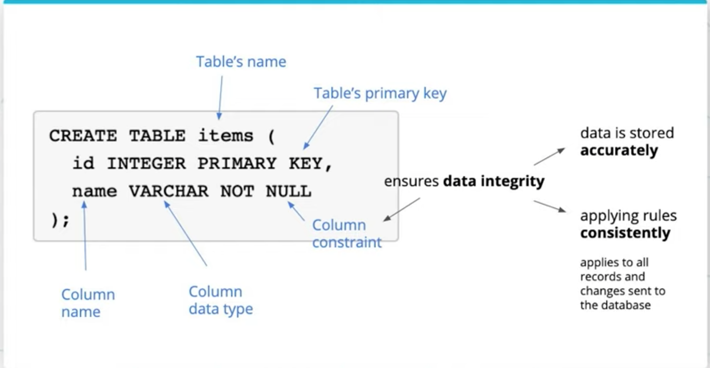

# SQLAlchemy Basics

## 1. Introduction

SQLAlchemy is the most popular open-source library for working with relational databases from Python. It is one type of ORM library, AKA an Object-Relational Mapping library, which provides an interface for using object oriented programming to interact with a database.

**Features**:

- Features function-based query construction: allows SQL clauses to be built via Python functions and expressions.
- Avoid writing raw SQL. It generates SQL and Python code for you to access tables, which leads to less database-related overhead in terms of the volume of code you need to write overall to interact with your models.
- Moreover, you can avoid sending SQL to the database on every call. The SQLAlchemy ORM library features automatic caching, caching collections and references between objects once initially loaded.

### Note on ORMs: are they a "best practice"

Using an ORM to interact with your database is simply one of many valid approaches for how you can add additional layers of abstraction to your web application to interact with a database more easily. There are other kinds of query builder libraries you can use that are between talking to a database directly (with a database driver library like pyscopg2), and using an ORM.

An ORM is considered to be the highest level of abstraction you can add to a web application for database management. Query Builder libraries are somewhere in the middle. There are many mixed opinions about whether ORMs are a best practice approach in all cases, such as this opinion on "[Why you should avoid ORMs](https://blog.logrocket.com/why-you-should-avoid-orms-with-examples-in-node-js-e0baab73fa5/)".

## 2. Layers of Abstraction

### SQLAlchemy vs psycopg2

- SQLAlchemy generates SQL statements
- psycopg2 directly sends SQL statements to the database.
- SQLAlchemy depends on psycopg2 or other database drivers to communicate with the database, under the hood

### Layers of SQLAlchemy


1. DBAPI
2. The Dialect
3. The Connection Pool
4. The Engine
5. SQL Expressions
6. SQLAlchemy ORM (optional)

## 4. The Connection Pool



## 5. The Engine

**The Engine is**:

- 1 of 3 main layers for how you may choose to interact with the database.
- Is the lowest level layer of interacting with the database, and is much like using the DBAPI directly. Very similar to using psycopg2, managing a connection directly.
- The Engine in SQLAlchemy refers to both itself, the Dialect and the Connection Pool, which all work together to interface with our database.
- A connection pool gets automatically created when we create a SQLAlchemy engine.

**More Read**:

- [SQLAlchemy Docs on the Engine](https://docs.sqlalchemy.org/en/13/core/engines.html)

## 6. SQL Expressions



## 7. SQLAlchemy ORM

SQLAlchemy ORM lets you compose SQL expressions by mapping python classes of objects to tables in the database. It is the highest layer of abstraction in SQLALchemy. It wraps the SQL Expressions and Engine to work together to interact with the database.


SQLAlchemy is split into two libraries:

- SQLAlchemy Core
- SQLAlchemy ORM (Object Relational Mapping library). SQLALchemy ORM is offered as an optional library, so you don't have to use the ORM in order to use the rest of SQLAlchemy.

The ORM uses the Core library inside. The ORM lets you map from the database schema to the application's Python objects. The ORM persists objects into corresponding database tables.

## 9. Hello App with Flask-SQLAlchemy - Part 1

### Initializing the app

`app = Flask(__name__)` sets the name of your app to the name of your module ("app" if "app.py" is the name of your file).

### Using `@app.route`

```python
@app.route('/')
def index():
    ...
```

In this case, `@app.route` is a *Python decorator*. Decorators take functions and returns another function, usually extending the input function with additional ("decorated") functionality. `@app.route` is a decorator that takes an input function index() as the callback that gets invoked when a request to route / comes in from a client.

See: [this primer on decorators from Real Python](https://realpython.com/primer-on-python-decorators/#decorators-with-arguments).

### Running the flask app

To start the server,

- We run a flask app defined at `app.py` with `FLASK_APP=app.py flask run`
  - `FLASK_APP` must be set to the server file path with an equal sign in between. No spaces. `FLASK_APP = app.py` will not work. These flags have to be set exactly as expected, as `FLAG=value`.
  - **Note**: different versions of flask take `FLASK_APP=app.py` versus `FLASK_APP=app`, etc.
- To enable live reload, set export `FLASK_ENV=development` in your terminal session to enable debug mode, prior to running flask run. Or call it together with flask run: `$ FLASK_APP=app.py FLASK_DEBUG=true flask run`

Alternative approach to run a Flask app: using `__main__`
Instead of using `$ flask run`, we could have also defined a method

```python
if __name__ == '__main__':
    app.run()
```

at the bottom of our app.py script, and then called `$ python3 app.py` in our terminal to invoke `app.run()` and run the flask app this way.

## 10. Connecting to the Database

**Code**:

```python
from flask import Flask
from flask_sqlalchemy import SQLAlchemy

app = Flask(__name__)
app.config['SQLALCHEMY_DATABASE_URI'] = 'postgresql://udacitystudios@localhost:5432/example'
db = SQLAlchemy(app)
```

`SQLALCHEMY_DATABASE_URI`:


## 11. `db.Model` and defining models


**Given an instance of the SQLAlchemy class from Flask-SQLAlchemy**:

```python
db = SQLAlchemy(app)
```

- `db` is an interface for interacting with our database
- `db.Model` lets us create and manipulate data models
- `db.session` lets us create and manipulate database transactions


**Declaring classes**:

- `class MyModel(db.Model)` will inherit from `db.Model`
- By inheriting from `db.Model`, we map from our classes to tables via SQLAlchemy ORM

**Defining columns**:

- Within our class, we declare attributes equal to `db.Column(...)`
- `db.Column` takes `<datatype>`, `<primary_key?>`, `<constraint?>`, `<default?>`

**Table naming**:

- By default, SQLAlchemy will pick the name of the table for you, setting it equal to the lower-case version of your class's name. Otherwise, we set the name of the table using `__tablename__ = 'my_custom_table_name'`.

```python
class Person(db.Model):
    __tablename__ = 'persons'
    id = db.Column(db.Integer, primary_key=True)
    name = db.Column(db.String(), nullable=False)
```

## 12. Syncing Models

`db.create_all()`:

Creates all tables if tables don't exist. SQLAlchemy names the table by the name of the class, all lower cased, by default. Then, if it finds a table with that name already, regardless of whether the schema matches the class, it will skip creating another table by that same name, and do nothing.

## 13. Inserting Records, Using Debug Mode

**Using Debug Mode**:

```bash
FLASK_DEBUG=true
```

Setting environment variable `FLASK_DEBUG=true` will set debug mode to ON, which will automatically restart the server whenever we make changes to our application.

We can set this in-line with our flask run command,

```bash
$ FLASK_DEBUG=true flask run
```

or export it ahead of time in our terminal session on a separate line before we run the server,

```bash
$ export FLASK_DEBUG=true
$ flask run
```

## 14. Experimenting in Interactive Mode

Create records using `db.session.add()`

```python
person = Person(name='Amy')
db.session.add(person)
db.session.commit()
```

## 15. SQLAlchemy Data Types


**Resources**:

- [Flask-SQLAlchemy: Declaring Models](https://flask-sqlalchemy.palletsprojects.com/en/2.x/models/)
- [Getting Started with PostgreSQL Data Types](https://www.postgresqltutorial.com/postgresql-data-types/)

## 16. SQLAlchemy Constraints



**Example**:

```python
class User(db.Model):
    ...
    name = db.Column(db.String(), nullable=False, unique=True)

# Example of how you would implement a constraint on an integer
class Product(db.Model):
    ...
    price = db.Column(db.Float, db.CheckConstraint('price>0'))
```

## 17. Recap


**Resources**:

- [SQLAlchemy Cheat Sheet](https://github.com/crazyguitar/pysheeet/blob/master/docs/notes/python-sqlalchemy.rst#set-a-database-url)
- [Using PostgreSQL through SQLAlchemy](https://www.compose.com/articles/using-postgresql-through-sqlalchemy/)
