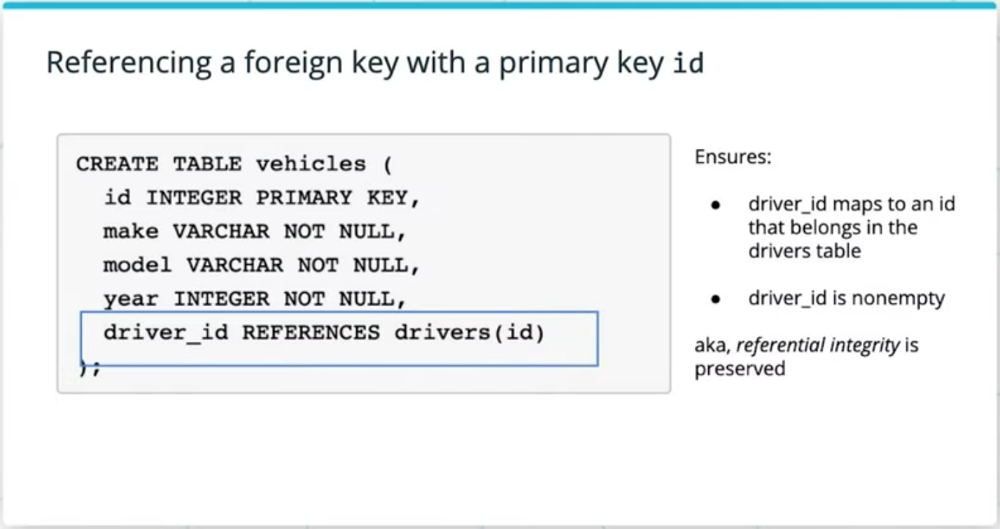
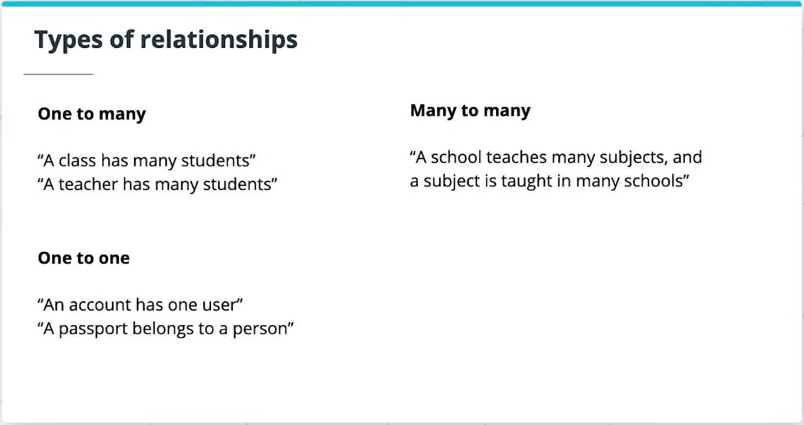
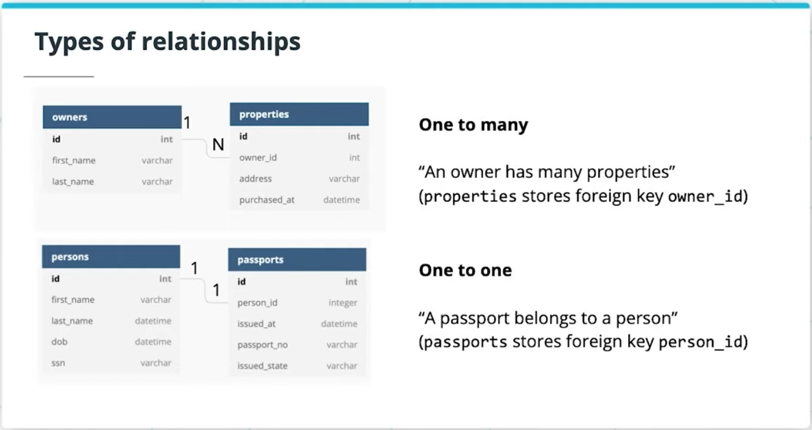
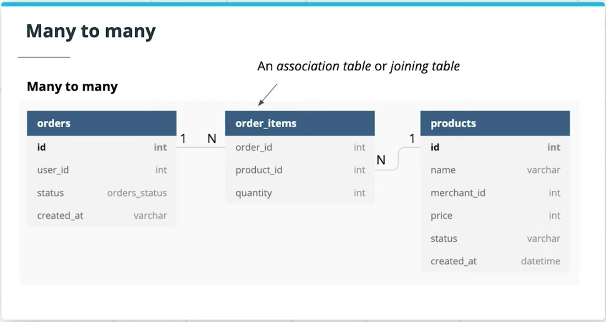

# Lesson 2-5. Build a CRUD App with SQLAlchemy

## Model View Controller (MVC)

**Takeaways**:

- MVC stands for Model-View-Controller, a common pattern for architecting web applications
- Describes the 3 layers of the application we are developing


**Layers**:

- **Models** manage data and business logic for us. What happens inside models and database, capturing logical relationships and properties across the web app objects
- **Views** handles display and representation logic. What the user sees (HTML, CSS, JS from the user's perspective)
- **Controllers**: routes commands to the models and views, containing control logic. Control how commands are sent to models and views, and how models and views wound up interacting with each other.

## Handling User Input

**Takeaways**:

- Creating, updating, and deleting information from a database requires handling user input on what is being created/updated/deleted. This will be the focus of the rest of this series.


**MVC Development**: How we'd add Create To-Do item functionality

- **On the view**: implement an HTML form
- **On the controller**: retrieve the user's input, and manipulate models
- **On the models**: create a record in our database, and return the newly created to-do item to the controller
- **On the controller**: take the newly created to-do item, and decide how to update the view with it.

**What we'll learn in order**:

1. **How we accept and get user data** in the context of a Flask app
2. **Send data in controllers** using database sessions in a controller
3. **Manipulating models** adding records in SQLAlchemy Models
4. **Direct how the view should update** within the controller and views

## Getting User Data in Flask

There are 3 methods of getting user data from a view to a controller.

- URL query parameters
- Forms
- JSON


### URL query parameters

URL query parameters are listed as key-value pairs at the end of a URL, preceding a "?" question mark. E.g. `www.example.com/hello?my_key=my_value`.

### Form data

`request.form.get('<name>')` reads the value from a form input control (text input, number input, password input, etc) by the ***name*** attribute on the input HTML element.

**Note**: defaults

`request.args.get`, `request.form.get` both accept an optional second parameter, e.g. `request.args.get('foo', 'my default')`, set to a default value, in case the result is empty.

The way form data traverses from the client to server differs based on whether we are using a GET or a POST method on the form.

#### The POST submission

- On submit, we send off an HTTP POST request to the route with a request body
- The request body stringifies the key-value pairs of fields from the form (as part of the ***name*** attribute) along with their values.

#### The GET submission

- Sends off a GET request with URL query parameters that appends the form data to the URL.
- Ideal for smaller form submissions.

POSTs are ideal for longer form submissions, since URL query parameters can only be so long compared to request bodies (max 2048 characters). Moreover, forms can only send POST and GET requests, and nothing else.

### JSON

`request.data` retrieves JSON as a string. Then we'd take that string and turn it into python constructs by calling `json.loads` on the `request.data` string to turn it into lists and dictionaries in Python.

## Using sessions in controllers

Commits can succeed or fail. On fail, we want to rollback the session to avoid potential implicit commits done by the database on closing a connection. Good practice is to close connections at the end of every session used in a controller, to return the connection back to the connection pool.

### Pattern (try-except-finally)

```python
import sys

try:
    todo = Todo(description=description)
    db.session.add(todo)
    db.session.commit()
except:
    db.session.rollback()
    error=True
    print(sys.exc_info())
finally:
    db.session.close()
```

## Relationships & Joins

**Read More**:

- [SQL Joins Explained](http://www.sql-join.com/sql-join-types)
- [SQL | Join (Inner, Left, Right and Full Joins)](https://www.geeksforgeeks.org/sql-join-set-1-inner-left-right-and-full-joins/)

## `db.relationship`


SQLAlchemy configures the settings between model relationships *once*, and generates `JOIN` statements for us whenever we need them.

- `db.relationship` is an interface offered in SQLAlchemy to provide and configure a mapped relationship between two models.
- `db.relationship` is defined on the parent model, and it sets:
  - the name of its children (e.g. children), for example `parent1.children`
  - the name of a parent on a child using the `backref`, for example `child1.my_amazing_parent`

**Resources**:

- [Flask-SQLAlchemy - Simple Relationships](https://flask-sqlalchemy.palletsprojects.com/en/2.x/quickstart/#simple-relationships)
- [SQLAlchemy Docs: Relationship API](https://docs.sqlalchemy.org/en/13/orm/relationship_api.html#sqlalchemy.orm.relationship)

## Configuring Relationships

When calling `child1.some_parent`, SQLAlchemy determines when we load the parent from the database.

### Why is it important to care about when we load parents

- Joins are expensive.
- We should avoid having the user idling. *Delays more than **150ms** are noticeable*, so milliseconds of performance matter!
- We should make sure the joins happen during a time and place in the UX that doesn't negatively impact the experience too much.

### Lazy loading vs. Eager loading

**Lazy loading**:

Load needed joined data only as needed. Default in SQLAlchemy.

- **Pro**: no initial wait time. Load only what you need.
- **Con**: produces a join SQL call every time there is a request for a joined asset. Bad if you do this a lot.

**Eager loading**:

Load all needed joined data objects, all at once.

- **Pro**: reduces further queries to the database. Subsequent SQL calls read existing data
- **Con**: loading the joined table has a long upfront initial load time.

`lazy=True` (lazy loading) is the default option in `db.relationship`:

```python
children = db.relationship('ChildModel', backref='some_parent', lazy=True)
```

See the [SQLAlchemy Docs on Relationship Loading Techniques](https://docs.sqlalchemy.org/en/13/orm/loading_relationships.html) for more loading options.

### Other relationship options: `collection_class` and `cascade`

`db.relationship`

- Allows SQLAlchemy to identity relationships between models
- Links relationships with backrefs (`child1.some_parent`)
- Configures relationship dynamics between parents and children, including options like `lazy`, `collection_class`, and `cascade`

**More Read**:

- [SQLALchemy ORM Relationship Docs](https://docs.sqlalchemy.org/en/13/orm/relationship_api.html#sqlalchemy.orm.relationship)

## Foreign Key Constraint Setup

`db.relationship` does not set up foreign key constraints for you. We need to add a column, `some_parent_id`, on the **child** model that has a foreign key constraint. Whereas we set `db.relationship` on the **parent** model, we set the foreign key constraint on the **child** model. A foreign key constraint prefers **referential integrity** from one table to another, by ensuring that the foreign key column always maps a primary key in the foreign table.




## Many-To-Many Relationships

### Types of relationships





### Keys in relationships; association tables

- In *one-to-many* and *one-to-one*, the **foreign key** is established on the child model.
- In *many-to-many*, a special **association table** exists to join the two tables together, storing two foreign keys that link to the two foreign tables that have a relationship with each other.

### Example with Order, Product, and Order Item

```python
order_items = db.Table('order_items',
    db.Column('order_id', db.Integer, db.ForeignKey('order.id'), primary_key=True),
    db.Column('product_id', db.Integer, db.ForeignKey('product.id'), primary_key=True)
)

class Order(db.Model):
    id = db.Column(db.Integer, primary_key=True)
    status = db.Column(db.String(), nullable=False)
    products = db.relationship('Product', secondary=order_items,
        backref=db.backref('orders', lazy=True))

class Product(db.Model):
    id = db.Column(db.Integer, primary_key=True)
    name = db.Column(db.String(), nullable=False)
```
