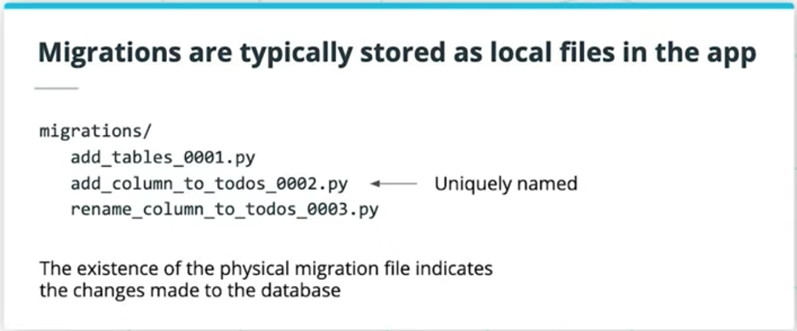
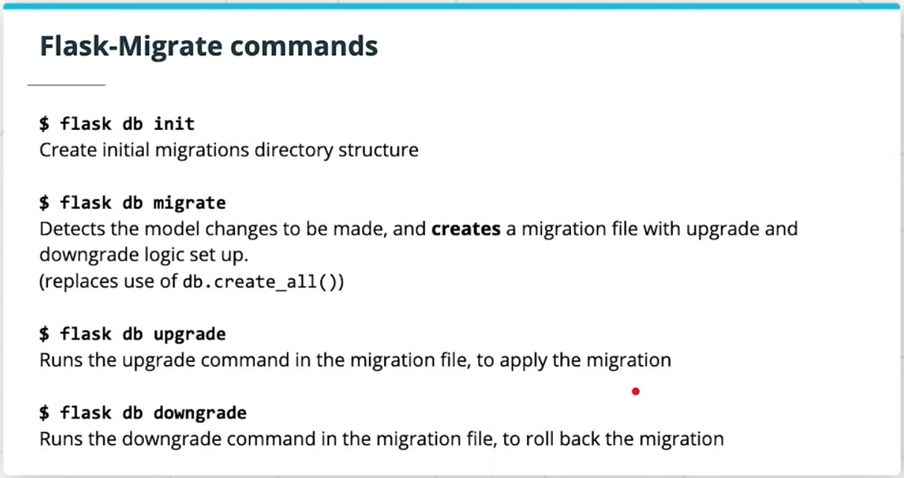

# Lesson 2-6. Migrations

## Introduction

### Takeaway

- Migrations deal with how we manage modifications to our data schema, over time.
- Mistakes to our database schema are very expensive to make. The entire app can go down, so we want to
  - quickly roll back changes, and
  - test changes before we make them
- A **migration** is a file that keep track of changes to our database schema (structure of our database).
  - Offers **version control** on our schema.

### Upgrades and rollbacks

- Migrations stack together in order to form the latest version of our database schema
- We can **upgrade** our database schema by **applying migrations**
- We can **roll back** our database schema to a former version by reverting migrations that we applied

## Migrations

- encapsulate a set of changes to our database schema, made over time.
- are uniquely named
- are usually stored as local files in our project repo, e.g. a migrations/ folder
- There should be a 1-1 mapping between the changes made to our database, and the migration files that exist in our migrations/ folder.
- Our migrations files set up the tables for our database.
- All changes made to our db should exist physically as part of migration files in our repository.

### Migration command line scripts

There are generally 3 scripts needed, for

- **migrate**: creating a migration script template to fill out; generating a migration file based on changes to be made
- **upgrade**: applying migrations that hadn't been applied yet ("upgrading" our database)
- **downgrade**: rolling back applied migrations that were problematic ("downgrading" our database)

**Read more**: [Flask-Migrate Docs](https://flask-migrate.readthedocs.io/en/latest/)

### Why use migrations

**Without migrations**:

- We do heavy-handed work, creating and recreating the same tables in our database even for minor changes
- We can lose existing data in older tables we dropped

**With migrations**:

- Auto-detects changes from the old version & new version of the SQLAlchemy models
- Creates a migration script that resolves differences between the old & new versions
- Gives fine-grain control to change existing tables

**This is much better, because**:

- We can keep existing schema structures, only modifying what needs to be modified
- We can keep existing data
- We isolate units of change in migration scripts that we can roll back to a “safe” db state

## Flask-Migrate

### Overall Steps to Set Up & Run Migrations

1. **Bootstrap database migrate commands**: link to the Flask app models and database, link to command line scripts for running migrations, set up folders to store migrations (as versions of the database)
2. **Run initial migration to create tables for SQLAlchemy models**, recording the initial schema: ala git init && first git commit. Replaces use of `db.create_all()`
3. **Migrate on changes to our data models**
   - Make changes to the SQLAlchemy models
   - Allow Flask-Migrate to auto-generate a migration script based on the changes
   - Fine-tune the migration scripts
   - Run the migration, aka “upgrade” the database schema by a “version”

**Read More**:

- [Alembic Docs](https://alembic.sqlalchemy.org/en/latest/)
- [Flask-Migrate Docs](https://flask-migrate.readthedocs.io/en/latest/)
