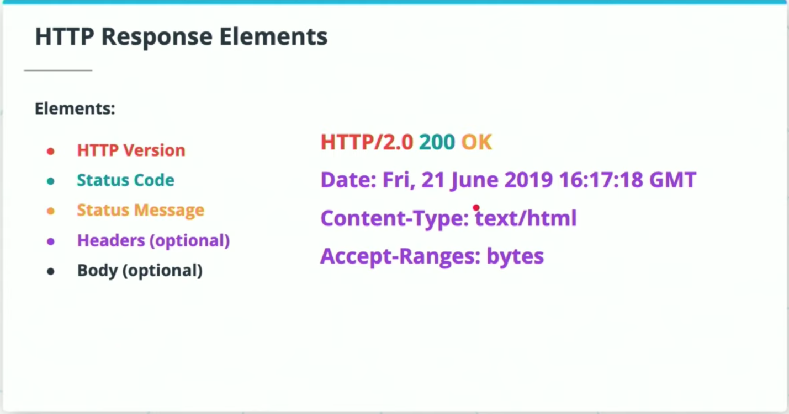

# Lesson 3-2. HTTP and Flask Basic

## 2. Introduction to HTTP

### HTTP: Hypertext Transfer Protocol

**Hypertext Transfer Protocol (HTTP)** is a protocol that provides a standardized way for computers to communicate with each other. It has been the foundation for data communication over the internet since 1990 and is integral to understanding how client-server communication functions.

### Features

- **Connectionless**: When a request is sent, the client opens the connection; once a response is received, the client closes the connection. The client and server only maintain a connection during the response and request. Future responses are made on a new connection.
- **Stateless**: There is no dependency between successive requests.
- **Not Sessionless**: Utilizing headers and cookies, sessions can be created to allow each HTTP request to share the same context.
- **Media Independent**: Any type of data can be sent over HTTP as long as both the client and server know how to handle the data format.

### Universal Resource Identifiers (URIs)

An example URI is `http://www.example.com/tasks/term=homework`. It has certain components:

- **Scheme**: specifies the protocol used to access the resource, HTTP or HTTPS. In our example `http`.
- **Host**: specifies the host that holds the resources. In our example `www.example.com`.
- **Path**: specifies the specific resource being requested. In our example, `/tasks`.
- **Query**: an optional component, the query string provides information the resource can use for some purpose such as a search parameter. In our example, `/term=homework`.

**More Read**:

- StackExchange: [What is the difference between a URI and a URL?](https://webmasters.stackexchange.com/questions/19101/what-is-the-difference-between-a-uri-and-a-url)
- StackOverflow: [What is the difference between a URI, a URL, and a URN?](https://stackoverflow.com/questions/176264/what-is-the-difference-between-a-uri-a-url-and-a-urn)
- [RFC 3986](https://www.ietf.org/rfc/rfc3986.txt), published by the [Internet Engineering Taskforce](https://en.wikipedia.org/wiki/Internet_Engineering_Task_Force)

## 3. HTTP Requests

```bash
GET http://www.example.com/tasks?term=homework HTTP/2.0
Accept-Language: en
```

```bash
GET /tasks?term=homework HTTP/2.0
Host: http://www.example.com
Accept-Language: en
```

HTTP requests are sent from the client to the server to initiate some operation. In addition to the URL, HTTP requests have other elements to specify the requested resource.

### Request Elements

- **Method**: Defines the operation to be performed
- **Path**: The URL of the resource to be fetched, excluding the scheme and host
- **HTTP Version**
- **Headers**: optional information, success as Accept-Language
- **Body**: optional information, usually for methods such as POST and PATCH, which contain the resource being sent to the server

### Request Methods

- **GET**: ONLY retrieves information for the requested resource of the given URI
- **POST**: Send data to the server to create a new resource.
- **PUT**: Replaces all of the representation of the target resource with the request data
- **PATCH**: Partially modifies the representation of the target resource with the request data
- **DELETE**: Removes all of the representation of the resource specified by the URI
- **OPTIONS**: Sends the communication options for the requested resource

## 4. HTTP Responses


After the request has been received by the server and processed, the server returns an HTTP response message to the client. The response informs the client of the outcome of the requested operation.



### Response Elements

- **Status Code & Status Message**
- **HTTP Version**
- **Headers**: similar to the request headers, provides information about the response and resource representation. Some common headers include:
  - **Date**
  - **Content-Type**: the media type of the body of the request
- **Body**: optional data containing the requested resource

### Status Codes

| Categories | Description | Common Codes |
| -- | -- | -- |
| `1xx` | Informational | |
| `2xx` | Success | `200`: OK <br> `201`: Created |
| `3xx` | Redirection | `304`: Not Modified |
| `4xx` | Client Error | `400`: Bad Request <br> `401`: Unauthorized <br>`404`: Not Found <br>`405`: Method Not Allowed <br> |
| `5xx` | Server Error | `500`: Internal Server Error |

**More Read**:

- [HTTP Dogs](https://httpstatusdogs.com/)
