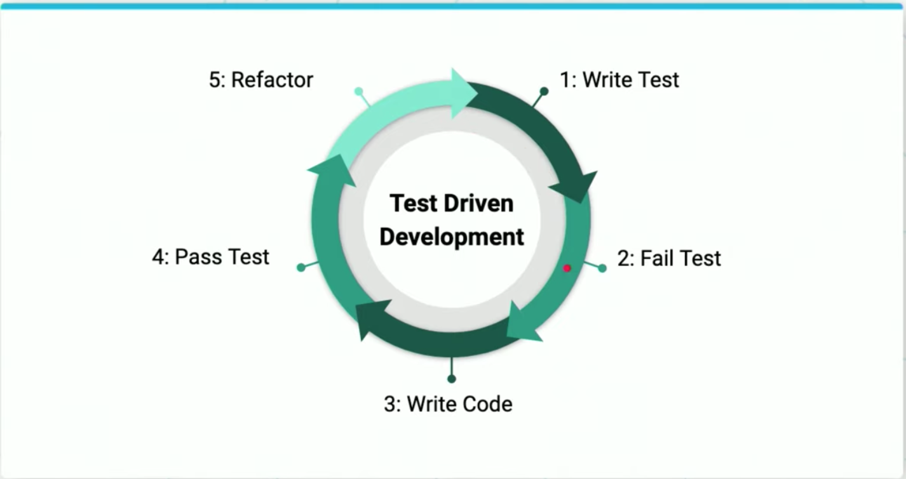

# Lesson 3-4. API Testing

## Why Testing

As with all tests, writing unittests for your API verifies the behavior. For APIs, test should be written:

- To confirm expected request handling behavior
- To confirm success-response structure is correct
- To confirm expected errors are handled appropriately
- To confirm CRUD operations persist

In addition to verifying behavior, having a thorough test suite ensures that when you update your API, you can easily test all previous functionality.

The order of operations for app development should always be:

1. Development
2. Unit Testing
3. Quality Assurance
4. Production

## Testing in Flask

```python
# Import all dependencies
import unittest
import json
from flaskr import create_app
from models import setup_db


class ResourceTestCase(unittest.TestCase):
    """This class represents the resource test case"""

    def setUp(self):
        """Define test variables and initialize app."""
        self.app = create_app()
        self.client = self.app.test_client
        self.database_name = "test_db"
        self.database_path = "postgres://{}/{}".format('localhost:5432', self.database_name)
        setup_db(self.app, self.database_path)

    def tearDown(self):
        """Executed after each test"""
        pass

    def test_given_behavior(self):
        """Test _____________ """
        res = self.client().get('/')

        self.assertEqual(res.status_code, 200)


# Make the tests conveniently executable
if __name__ == "__main__":
    unittest.main()
```

## Test-Driven Development (TDD) for APIs

**Test-Driven Development** (or **TDD**) is a software development paradigm used very commonly in production. It is based on a short, rapid development cycle in which tests are written before the executable code and constantly iterated on.



1. Write test for specific application behavior.
2. Run the tests and watch them fail.
3. Write code to execute the required behavior.
4. Test the code and rewrite as necessary to pass the test
5. Refactor your code.
6. Repeat - write your next test.

Often while pair programming, one partner will write the test and the other will write the executable code, after which the partner will switch. This process is helpful for checking assumptions about behavior and making sure all expected behavior is captured.
