# Lesson 4-2. Identity and Authentication

## Common Authentication Methods

Username and Passwords is the most common method of identifying users in the age of Software as a Service (Saas).

### Brief Intro to Problems with Passwords

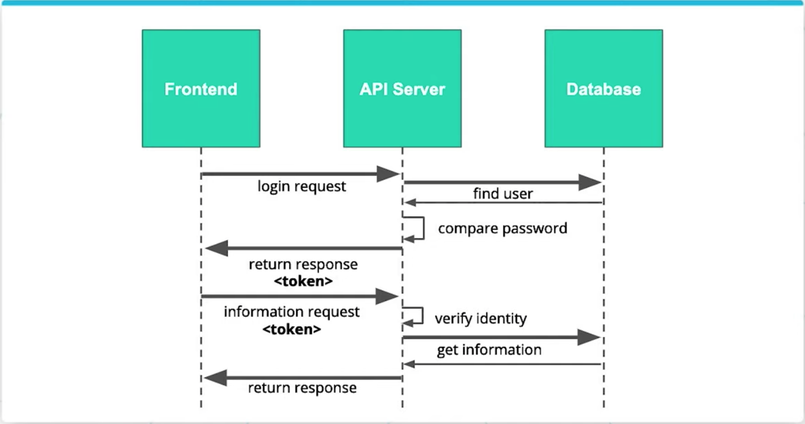

Some issues with passwords are **outside of our control** as developers. Many issues come from user behavior that we cannot directly influence, such as:

- Users forget their passwords
- Users use simple passwords
- Users use common passwords
- Users repeat passwords
- Users share passwords

In contrast, some issues are **within our control** as developers:

- Passwords can be compromised
- Developers can incorrectly check
- Developers can cut corners

## Alternative Authentication Methods

### Single Sign-On (SSO)

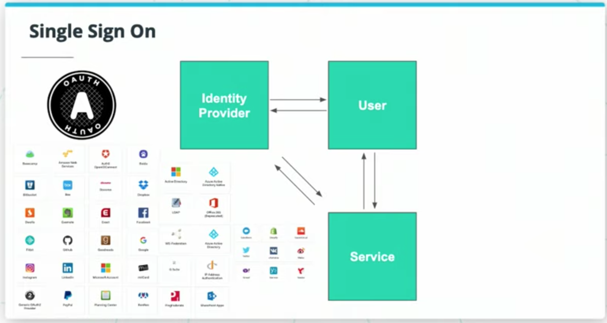

Trust someone else to answer who you are.

**Pros**:

- We don't have to perform the actual authentication. We are trusting some engineers at a large robust system is doing it for us.
- Better User Experience

### Multi-Factor Authentication

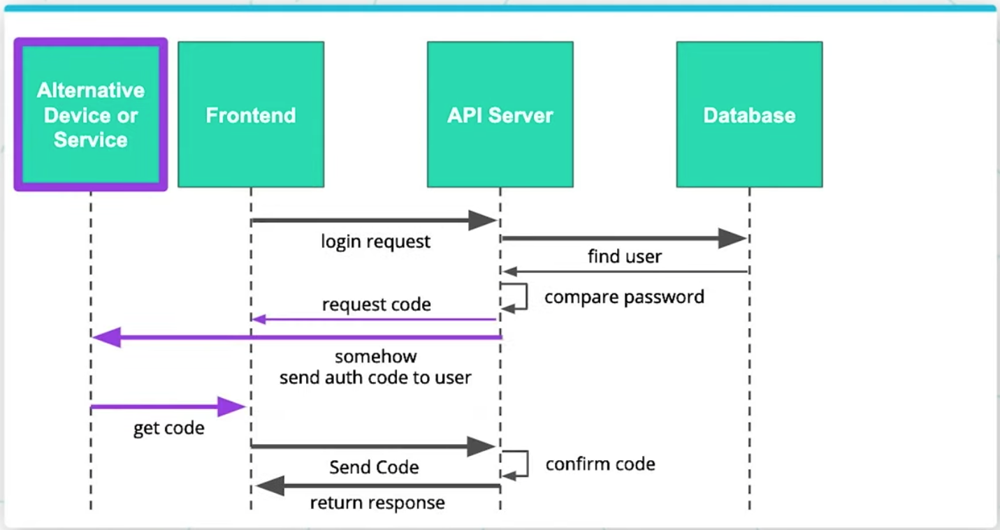

Multi-Factor Authentication gives us one layer of trust on top of a password. Confirmation code is generated using decaying temporal algorithm.

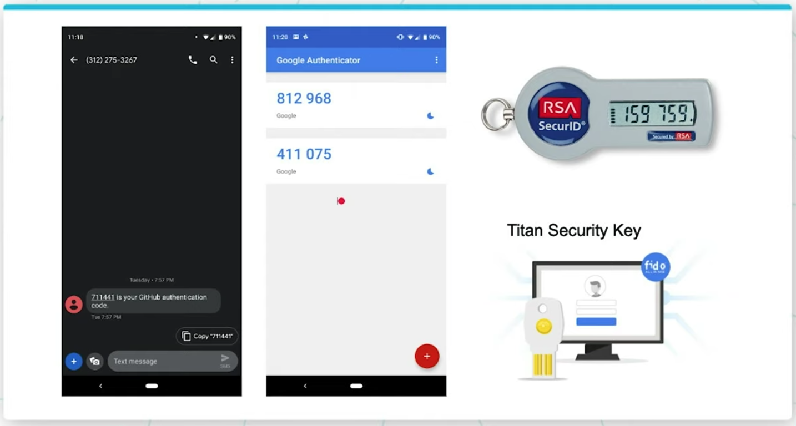

**Examples**:

- Server generate a random code and send it to users' phone on text message
- Temporary code generated by decaying temporal algorithm

### Passwordless

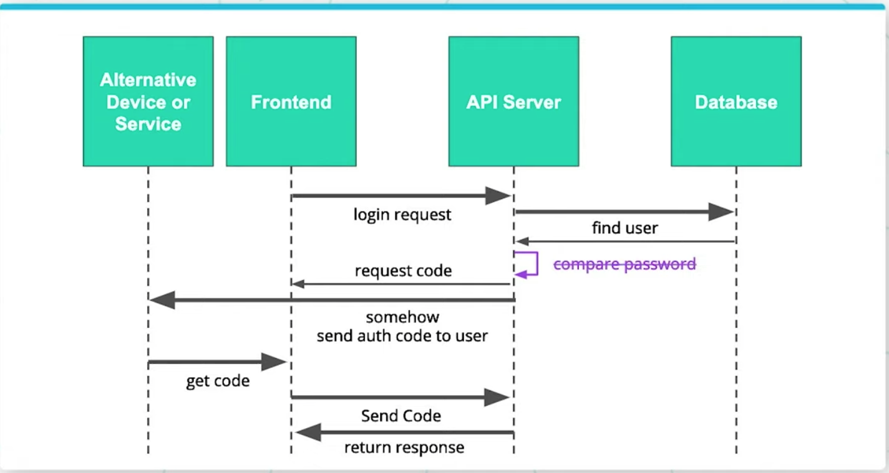

Password is terrible way to authenticate, so remove it.

**Examples**:

- Slack Magic Links
- Google Cellphone Sign In

### Additional Readings

- [Oath2](https://oauth.net/2/)
- [Auth0 Identity Providers](https://auth0.com/docs/identityproviders)
- [Google Identity Platform](https://developers.google.com/identity/)
- [Magic Links](https://hackernoon.com/magic-links-d680d410f8f7)
- [iOS Biometrics](https://developer.apple.com/documentation/localauthentication)
- [Google Authenticator](https://play.google.com/store/apps/details?id=com.google.android.apps.authenticator2&hl=en_US)
- [Dance Dance Authentication (Enjoy 😊)](https://www.youtube.com/watch?v=VgC4b9K-gYU&feature=youtu.be)

## Third-Party Auth Systems

Why Delegate the Responsibility?

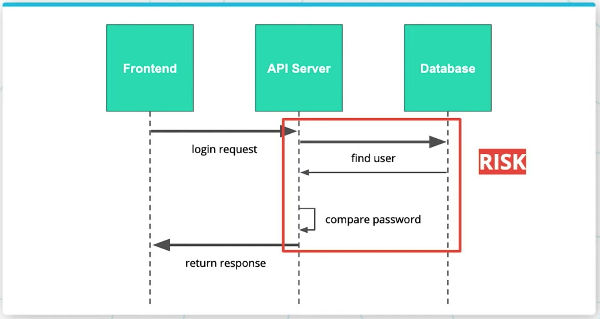

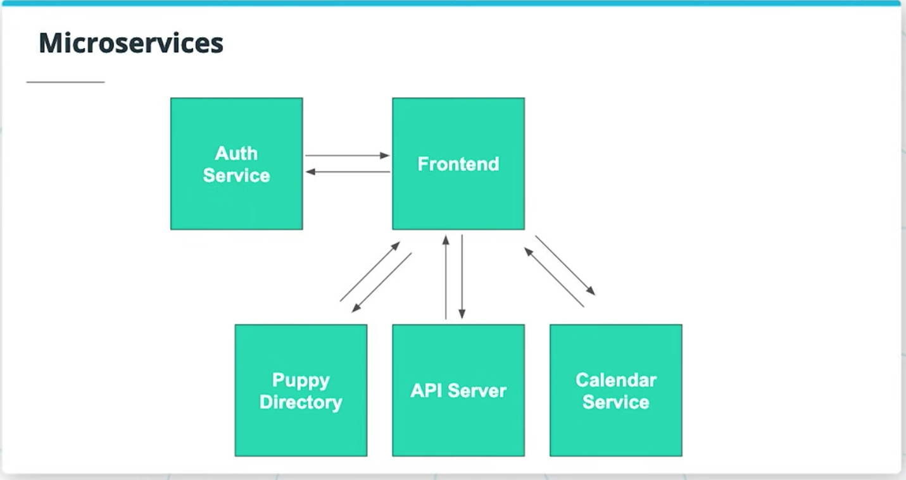


## JWT - JSON Web Tokens

Traditionally, server validated authentication using a session table. A session table stores a session id and the user id pair in a database.

### JWT Features


- Stateless
- Difficult to fake
- Popular and easily implemented across platforms
- Flexible

### JWT - Data Structure

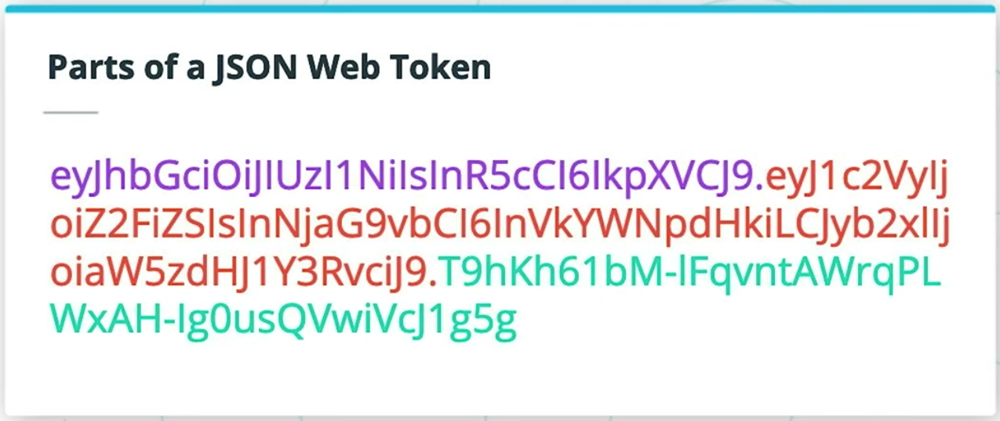
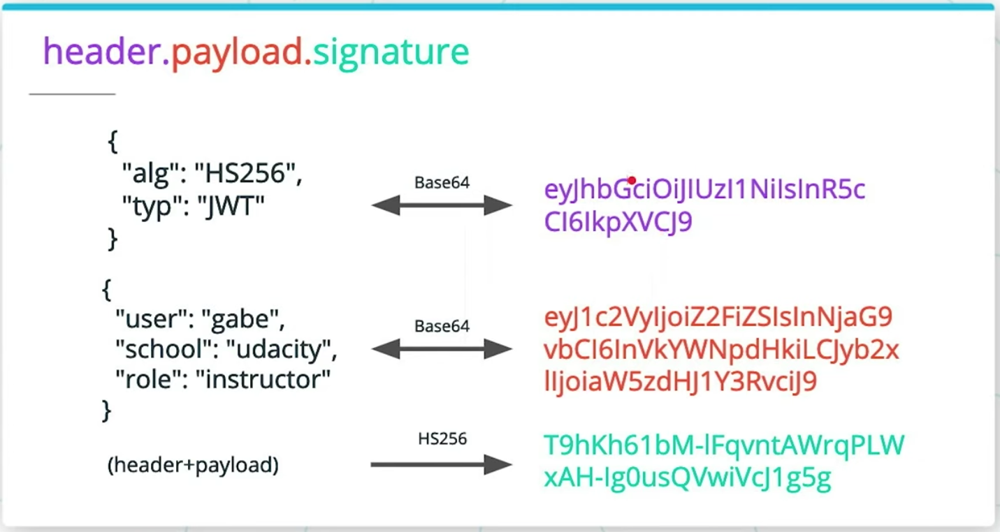

### JWT - Validation


**More Read**:

- [JWT.io](https://jwt.io/introduction/) a useful guide and list of popular JSON Web Token implementations.
- [Base64 Encoding](https://en.wikipedia.org/wiki/Base64)
- [HMAC](https://en.wikipedia.org/wiki/HMAC) keyed-hash message authentication code

## Practice - Generating and Verifying JWTs

```python
# Import Python Package
import jwt
import base64

# Init our Data
payload = {'park':'madison square'}
algo = 'HS256' #HMAC-SHA 256
secret = 'learning'

# Encode a JWT
encoded_jwt = jwt.encode(payload, secret, algorithm=algo)
print(encoded_jwt)

# Decode a JWT
decoded_jwt = jwt.decode(encoded_jwt, secret, verify=True)
print(decoded_jwt)

# Decode with Simple Base64 Encoding
decoded_base64 = base64.b64decode(str(encoded_jwt).split(".")[1]+"==")
print(decoded_base64)
```

## Local Storage


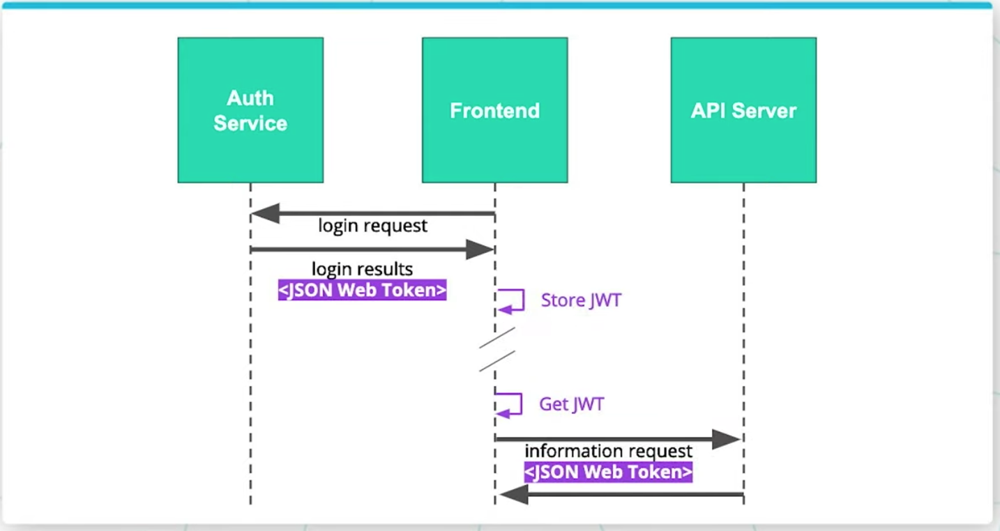
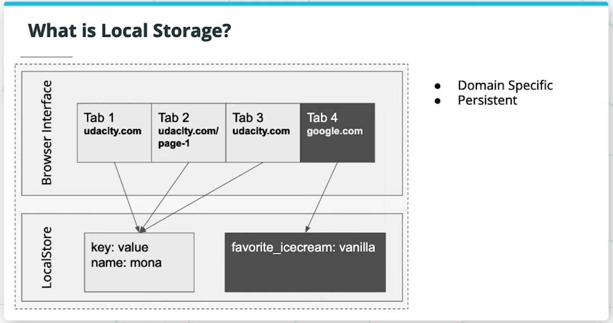

[Local Storage](https://developer.mozilla.org/en-US/docs/Web/API/Window/localStorage) is an implementation of a [key-value](https://en.wikipedia.org/wiki/Key%E2%80%93value_database) store which is accessible through a javascript interface in most modern browsers. It is a general purpose interface to store strings which will persist in memory from session to session. It is designed for smaller strings and alternative opensource systems like [localForage](https://github.com/localForage/localForage) exist for large amounts of data.

**Features**:

- Site specific
- Persistent from session to session
- Cross browser compatible

## Storing JWT

### Security Considerations of Local Storage

#### Cross-Site Scripting Attacks (XSS)

Inject foreign code into a website to execute on that site on the client itself:

- through unsanitized and rendered HTML inputs
- through Compromised 3rd party hosted JavaScript
- through compromised JavaScript dependencies

#### Rules to follow working with JWT

- **Never** store sensitive information whthin JWT
- JWT should be expired relatively frequently

**More Reads**:

- [Google Chrome](https://developer.chrome.com/apps/storage) Storage documentation
- [MDN Web Docs](https://developer.mozilla.org/en-US/docs/Web/API/Window/localStorage) LocalStorage Documentation
- Security Considerations of Local Storage
  - [Why Cookies Aren't Necessarily Safer](https://dev.to/jondubois/comment/373l)
  - [OWASP XSS Cheat Sheet](https://github.com/OWASP/CheatSheetSeries/blob/master/cheatsheets/Cross_Site_Scripting_Prevention_Cheat_Sheet.md)
  - [Using Refresh Tokens with Auth0](https://auth0.com/docs/tokens/refresh-token/current)
  - [HTTP Only Cookies](https://blog.codinghorror.com/protecting-your-cookies-httponly/)
  - [Getting Cookies in Flask](http://flask.pocoo.org/docs/1.0/quickstart/#cookies)
- Alternatives to LocalStorage]
  - [localForage](https://localforage.github.io/localForage/) javascript library capable of more complex storage tasks.
  - [HttpOnly Cookies](https://owasp.org/www-community/HttpOnly) so javascript can't access the token at all.

## Sending Tokens

### Sending Tokens from Popular Frontend Frameworks

- [React + Redux - JWT Tutorial](https://jasonwatmore.com/post/2017/12/07/react-redux-jwt-authentication-tutorial-example) There are many ways to include JWTs in requests from frontend frameworks. Jason Watmore has many tutorials for your frontend flavor of choice.
- [Angular Interceptors](https://medium.com/@ryanchenkie_40935/angular-authentication-using-the-http-client-and-http-interceptors-2f9d1540eb8) for Authorization Headers

**Additional Reading**:

- [MDN Web Docs](https://developer.mozilla.org/en-US/docs/Web/HTTP/Headers/Authorization) Authorization Header Documentation.
- [Postman Authorization](https://learning.getpostman.com/docs/postman/sending_api_requests/authorization/) Including authorization headers in postman requests.
