# Lesson 4-3. Passwords

## Problems with Plain Text

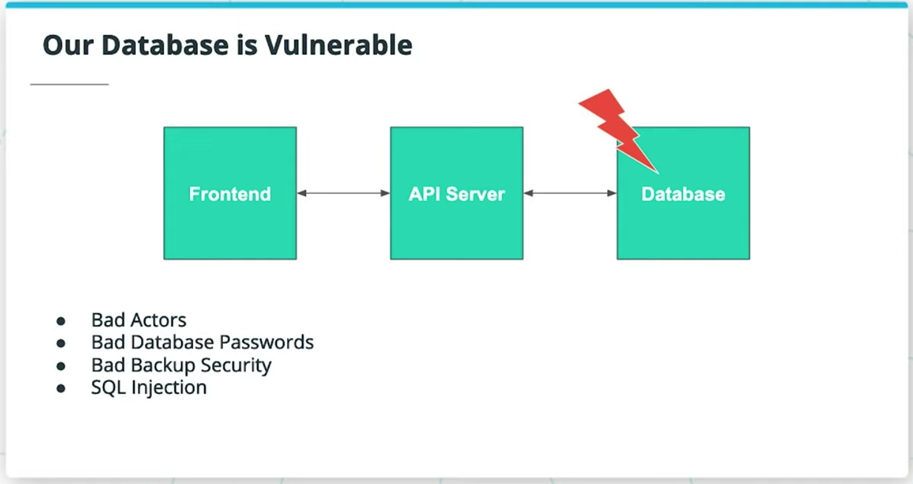
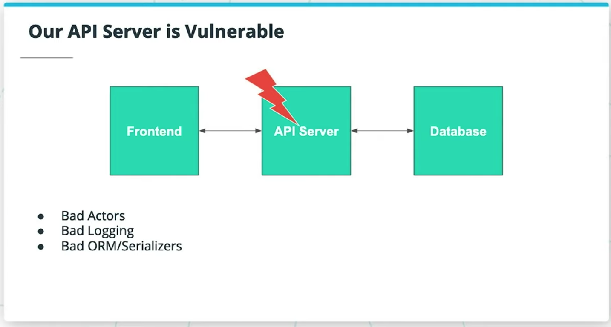
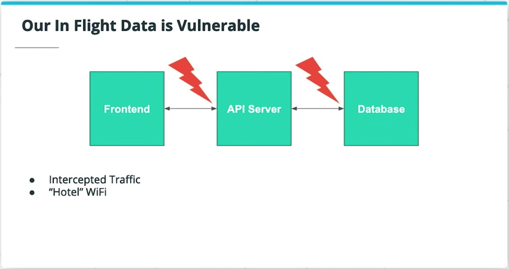

**Additional Reading**:

- [Facebook](https://www.theverge.com/2019/3/21/18275837/facebook-plain-text-password-storage-hundreds-millions-users)
- [Large Power Utility.](https://arstechnica.com/tech-policy/2019/02/plain-wrong-millions-of-utility-customers-passwords-stored-in-plain-text/)
- [haveibeenpwned.com](https://haveibeenpwned.com/)

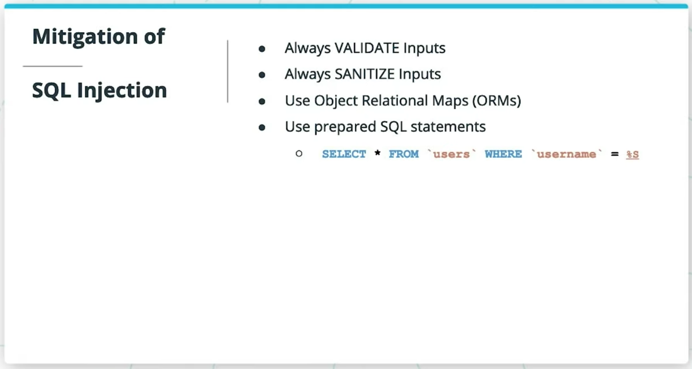

Steps to minimize the risk of compromising user tables:

- Choose complex admin passwords for our databases
- Use ORMs
- Use input validation and sanitize any user submitted data
- Use prepared or parameterized SQL statements
- Store our backups as securely as our production databases

**Additional Resources**:

- [Bandit CLI Wargame](https://overthewire.org/wargames/bandit/bandit0.html) - This wargame helps you learn CLI and security while you have fun!

## Problems - Brute Force Attacks

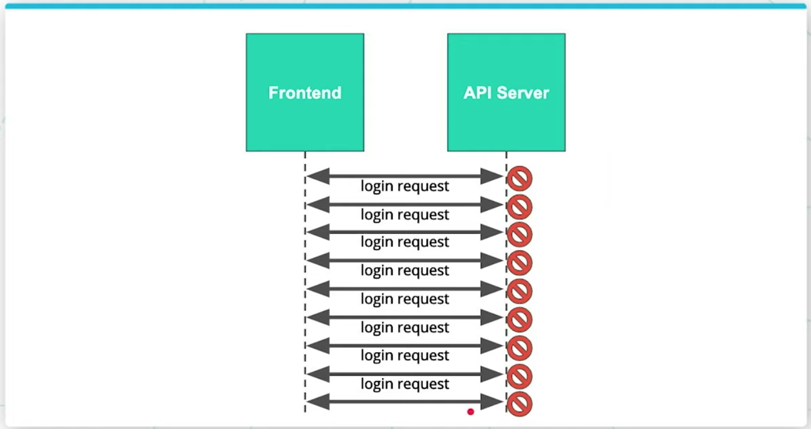
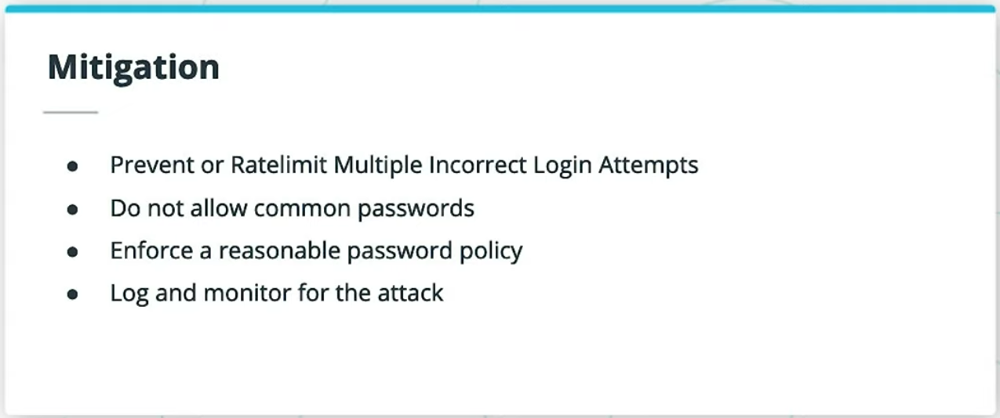

### An Alternative to Rate-Limiting: CAPTCHAs

[CAPTCHA](https://en.wikipedia.org/wiki/CAPTCHA): **c**ompletely **a**utomated **p**ublic **T**uring test to tell **c**omputers and **h**umans **a**part

Example: [Google reCAPTCHA](https://developers.google.com/recaptcha/docs/v3)

## Problems - Data Handling and Logging

### Serialization of Models

[Serialization](https://en.wikipedia.org/wiki/Serialization) is the process of transforming a data model into a more easily shared format.

#### What should we NOT be serialized

- Personally identifiable Information
- **Passwords**

### Logging Best Practices

#### What should we log

- Information that leaves an audit trail
  - Login attempts(ids)
  - Login Sources
  - Requested Resources

#### What should we NOT log

- Personally identifiable Information
- Secrets
- **Passwords**

**Additional Reading**:

- [Facebook Logging Plain Text Passwords](https://www.theverge.com/2019/3/21/18275837/facebook-plain-text-password-storage-hundreds-millions-users)

## Introduction to Encryption

### Symmetric Encryption

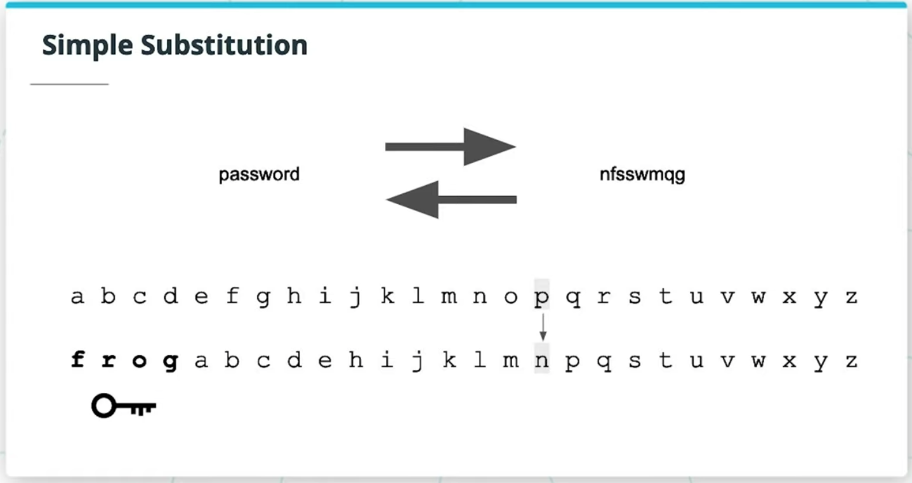
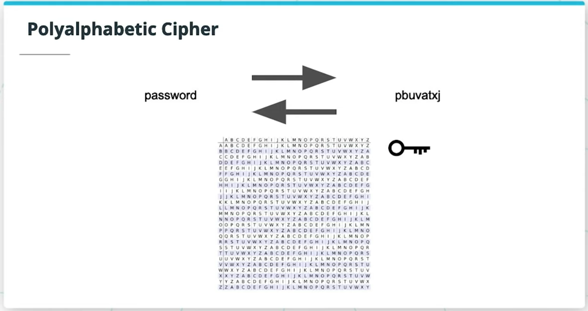

### Encryption in the Digital World

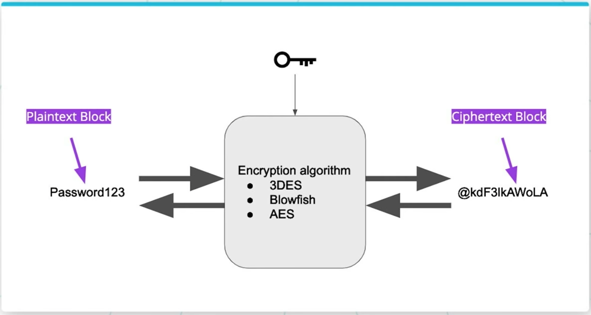
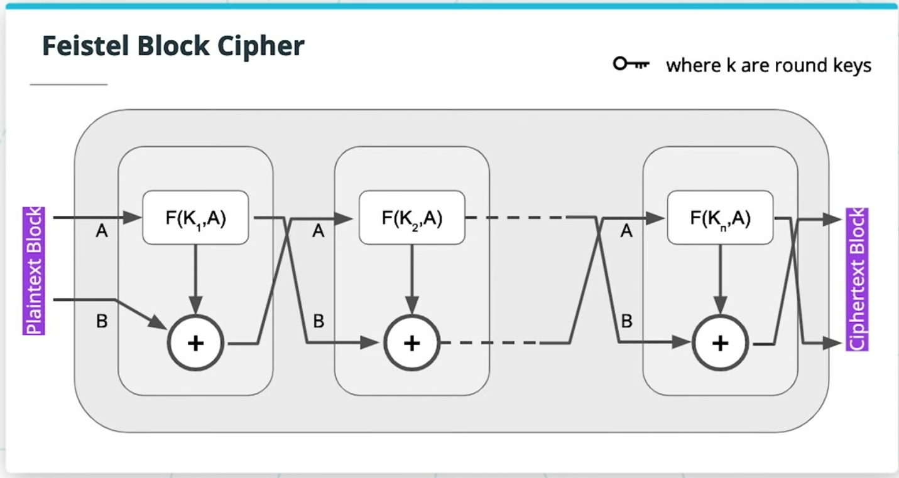

## Using the Cryptography Python Package

```python
# Import Package
from cryptography.fernet import Fernet

# Generate a Key and Instantiate a Fernet Instance
key = Fernet.generate_key()
f = Fernet(key)
print(key)

# Define our message
plaintext = b"encryption is very useful"

# Encrypt
ciphertext = f.encrypt(plaintext)
print(ciphertext)

# Decrypt
decryptedtext = f.decrypt(ciphertext)
print(decryptedtext)
```

## Asymmetric Encryption

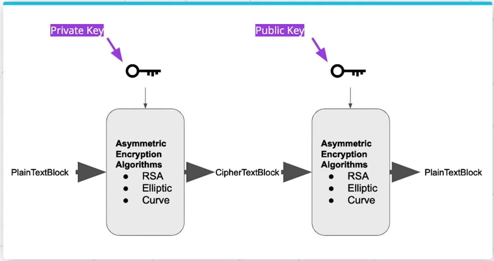

Asymmetric Encryption is being used to minimize API server & In-flight data vulnerabilities. (HTTPS / TLS / SSL)

## Hashing

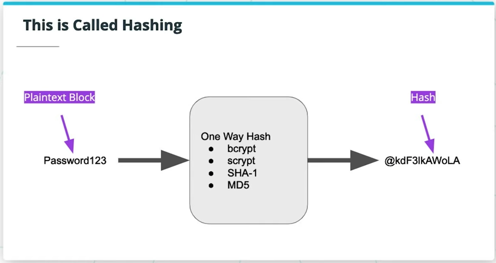
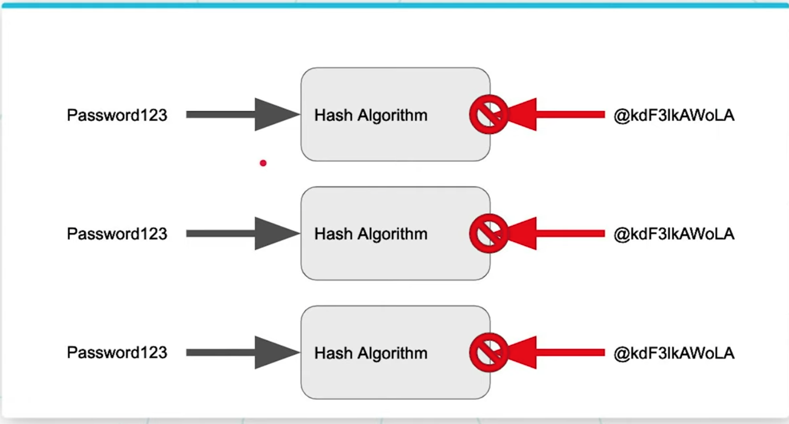

- Encryption function: Scrambles text in a reversable way
- Hash function: One way function that produces a unique message digest

### Using Hashing to Secure Our User Tables

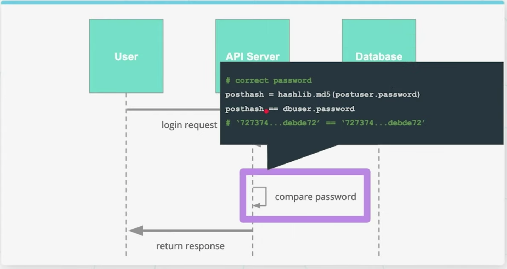

> Even though user passwords are hashed, hackers can guess passwords using Rainbow tables.

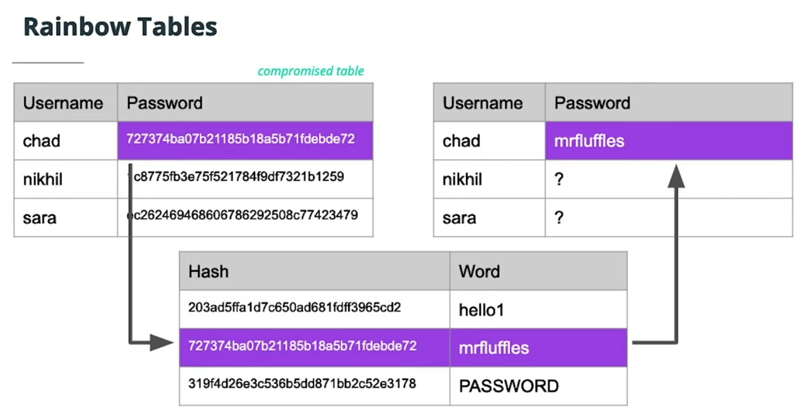

**Additional Resources**:

- [Wikipedia hash function security summary](https://en.wikipedia.org/wiki/Hash_function_security_summary)
- [Making a Faster Cryptanalytic Time-Memory Trade-Of](https://lasec.epfl.ch/pub/lasec/doc/Oech03.pdf) - Original paper first describing and naming Rainbow Tables!

## Hashing with Salts

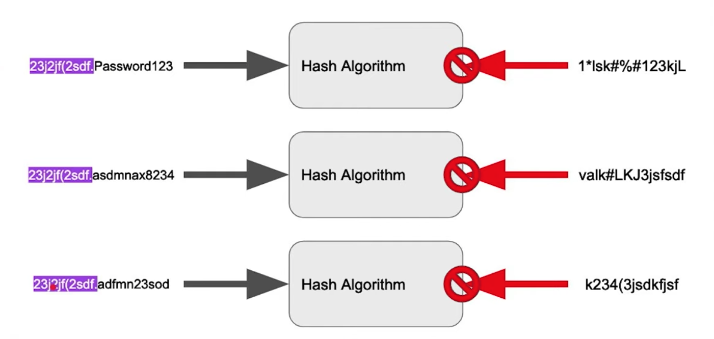
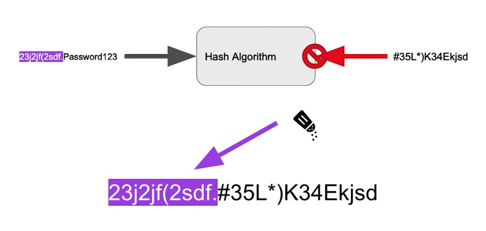
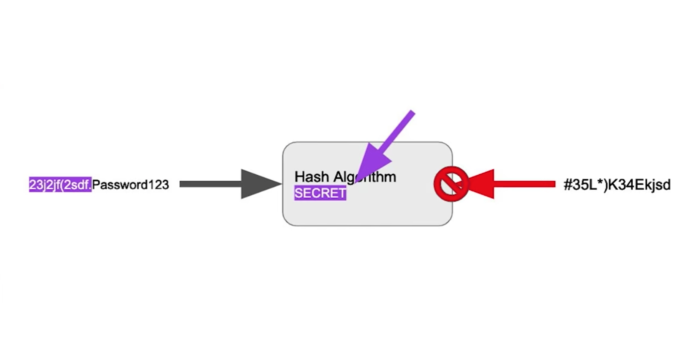

### Salt Rounds

This is a cost factor for how many times a password and salt should be re-hashed. In other words if you choose 10 salt rounds, the calculation is performed `2^10` or `1024` times. Each attempt takes the hash from the previous round as an input. The more rounds performed, the more computation is required to compute the hash. This will not cause significant time for a single attempt (i.e. checking a password at login), but will introduce significant time when attempting to brute force or generate rainbow tables.

## Python: Salted, Hashed Passwords

```python
# Import the Python Library
import bcrypt

password = b"studyhard"
# Hash a password for the first time, with a certain number of rounds
salt = bcrypt.gensalt(14)
hashed = bcrypt.hashpw(password, salt)
print(salt)
print(hashed)
# Check a plain text string against the salted, hashed digest
bcrypt.checkpw(password, hashed)
```

## Additional Resources

- Security and Password Policies
  - [NPM Security Policy](https://www.npmjs.com/policies/security)
  - [Good blog post on password policies](https://blog.devolutions.net/2018/02/top-10-password-policies-and-best-practices-for-system-administrators)
- Password Managers
  - [LastPass](https://www.lastpass.com/)
  - [Chrome Password Manager](https://support.google.com/chrome/answer/95606?co=GENIE.Platform%3DDesktop&hl=en) (better than a postit)
