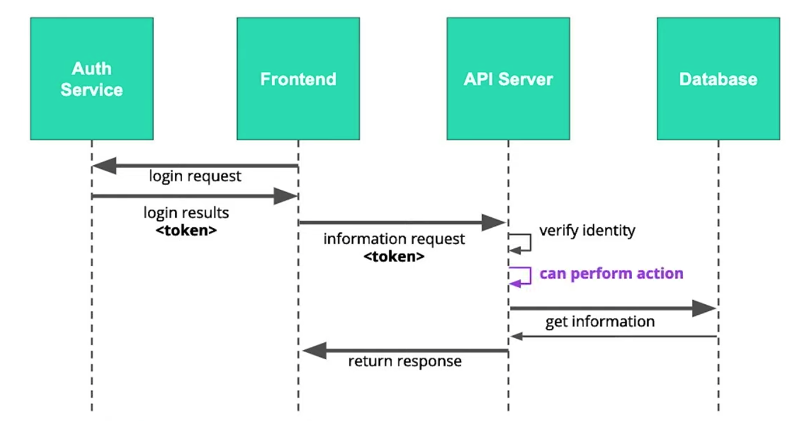
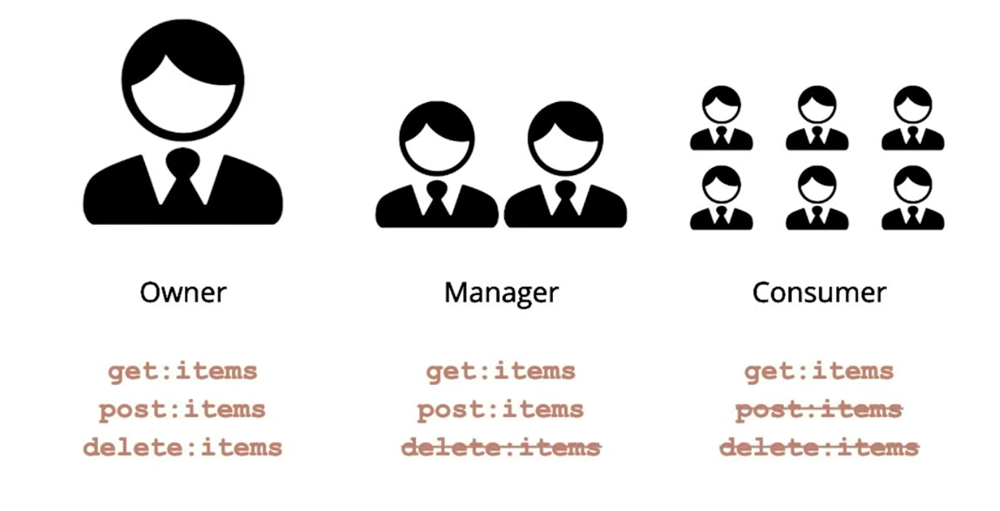
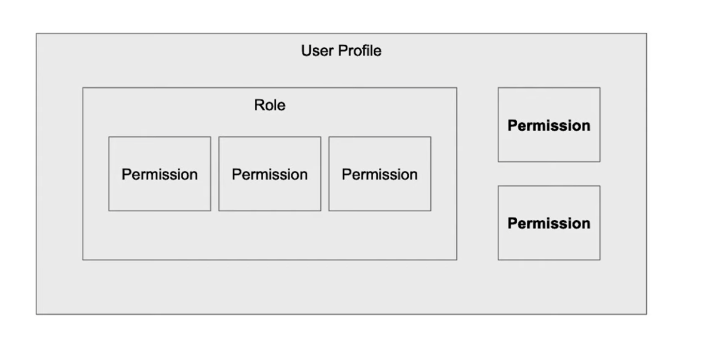
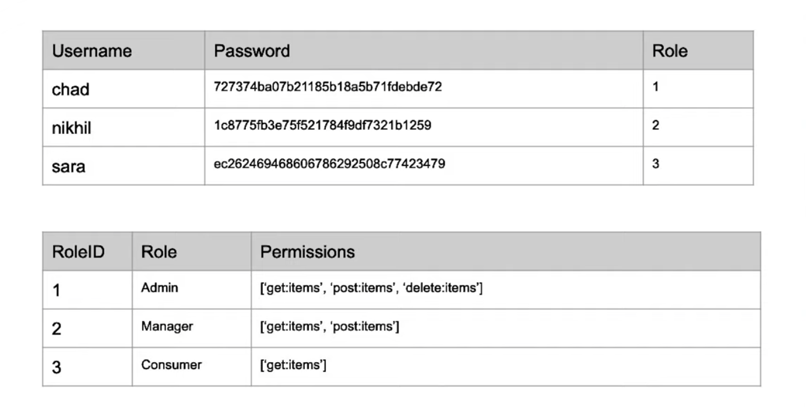
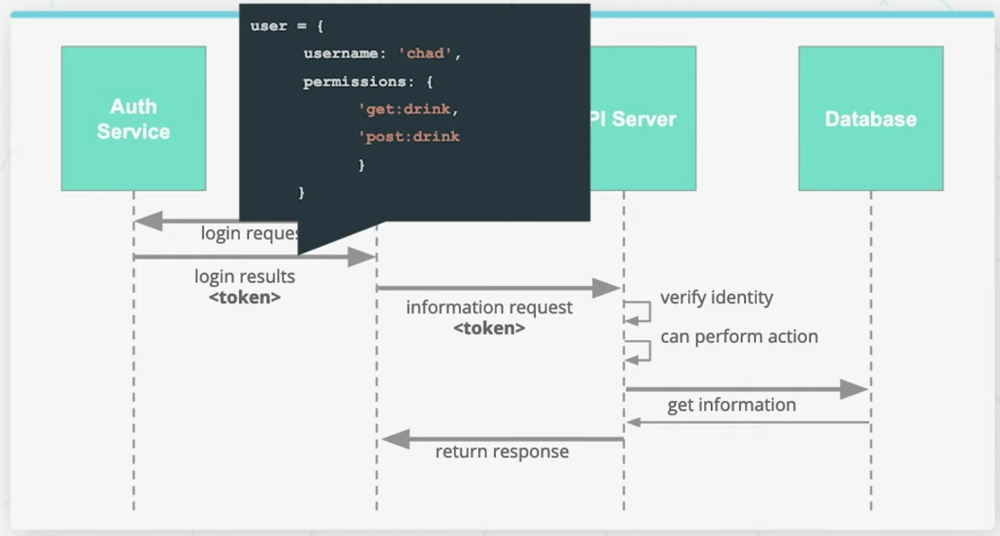
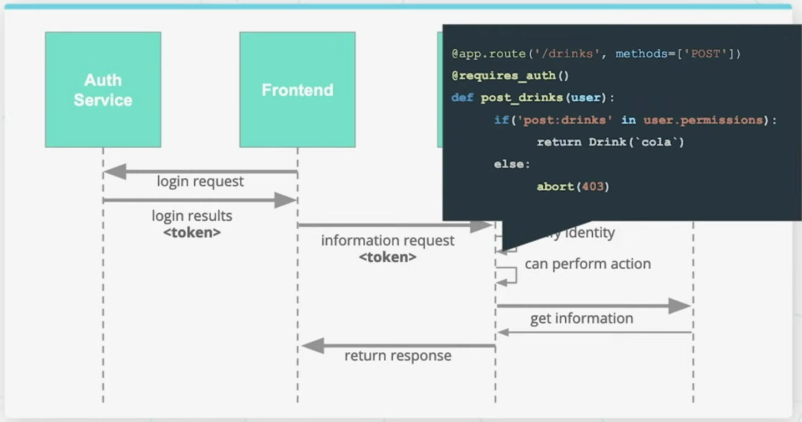

# Lesson 4-4. Access and Authorization

## Role-Permission Based Access

### Authorization in our Digital Sequence

**Additional Resources**:

- [StackExchange discussion](https://softwareengineering.stackexchange.com/questions/299729/role-vs-permission-based-access-control) on RBAC vs PBAC
