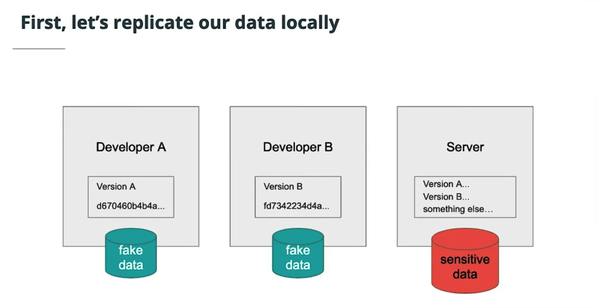
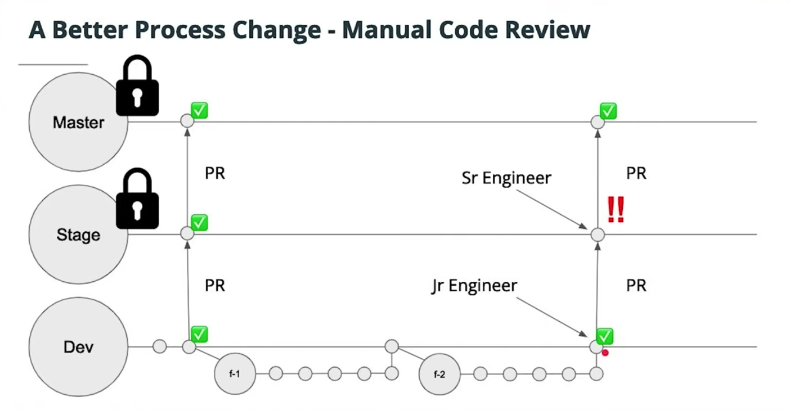

# Lesson 4-5. Thinking Adversarially

## Limiting Access to Code and Systems

### Using Git Effectively

### Configuring GitHub with Restrictions

- Settings > Branch > Change Default Branch
- Add Branch Protection Rules

**Additional Reading**:

- [Palantir Blog on Code Review](https://medium.com/palantir/code-review-best-practices-19e02780015f)
- [AWS IAM Best Practices](https://docs.aws.amazon.com/IAM/latest/UserGuide/best-practices.html)

## Auth Validation Testing

- [Postman Command Line Interface for Continuous Integration and Delivery](https://learning.getpostman.com/docs/postman/collection_runs/command_line_integration_with_newman/)
- [I'll Let Myself In: Tactics of Physical Pen Testers - WildWest Hackin' Fest](https://www.youtube.com/watch?v=rnmcRTnTNC8)
- [Lock Picking Lawyer](https://www.youtube.com/channel/UCm9K6rby98W8JigLoZOh6FQ) YouTuber dedicated to demonstrating security capabilities of common physical locks.
- [Kitboga](https://www.youtube.com/channel/UCm22FAXZMw1BaWeFszZxUKw) A YouTuber who engages with social attacks.

## Alternate Attack Vectors

- [Phishing Malicious Apps to Bypass MFA](https://en.wikipedia.org/wiki/Phishing)
- [Wikipedia Article on Phishing](https://www.welivesecurity.com/2019/06/17/malware-google-permissions-2fa-bypass/) - A great resource of history and some common attacks

## Staying Ahead of the Attackers

- [OWASP Top 10 Report](https://owasp.org/search/?searchString=top+10)
- [Wild West Hackin' Fest](https://www.youtube.com/watch?v=mG87meKVrzc)
- [SOC 2 Compliance](https://en.wikipedia.org/wiki/SSAE_16)
