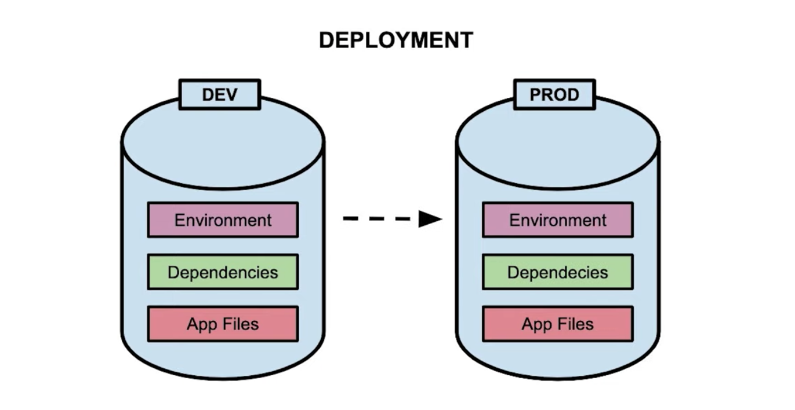
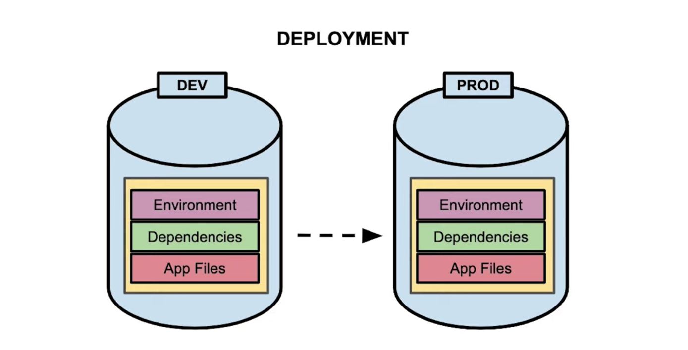
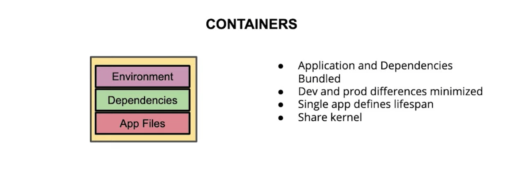
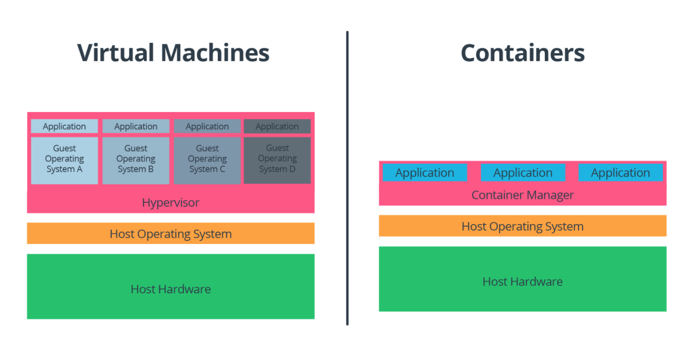
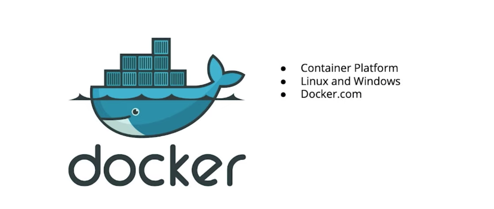
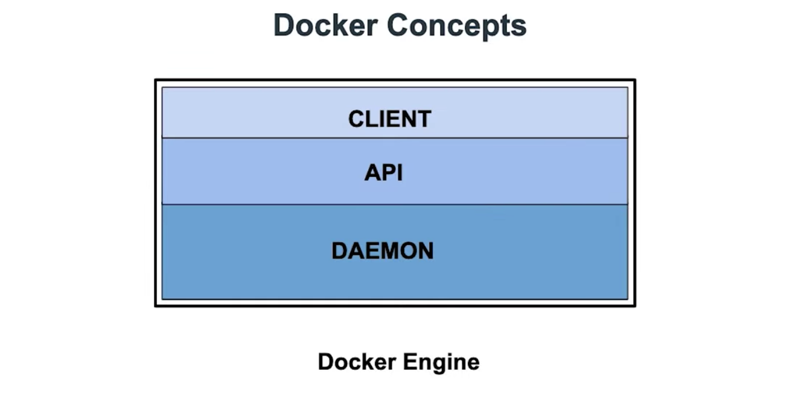
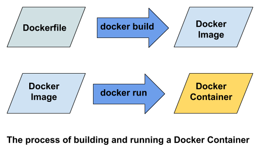

# Lesson 5-2. Containers

## Lesson Overview

If you plan to deploy your application to the cloud or other production environment, you will need your application to run in a different environment from your development machine. Unfortunately, you might not have direct control over the cloud environment or the software installed, and this could cause problems for your application.

One solution to this problem is to use an additional piece of software that can bundle your application’s dependencies with your application. Two options for this kind of software are *containers* and *virtual machines*. In this lesson, you will:

- Learn about containers
- Understand the difference between containers and VMs
- Learn about the most popular container system: Docker
- Pull and run pre-built containers from the DockerHub container registry
- Learn how to create your own container images using a text document called a Dockerfile

## What is a Container

In this concept, you will learn about containers, which will solve the problem of environment consistency when you deploy your application from a development environment to a production environment.






Two ways of bundling an application with its environment and dependencies are containers and [virtual machines](https://en.wikipedia.org/wiki/Virtual_machine). Both methods allow an application to be run with minimal differences between development and production, and both can be used to horizontally scale an application.

Multiple containers and VMs can be run on the same machine, but containers running on the same machine share the same low-level operating system [kernel](https://en.wikipedia.org/wiki/Kernel_%28operating_system%29). You will learn more virtual machines and how they differ from containers more in the next concept.

**Further Research**:

- [Docker overview of containers](https://www.docker.com/resources/what-container)
- [Redhat article on Docker containers](https://www.redhat.com/en/topics/containers/what-is-docker)

## Containers vs. Virtual Machines



A **virtual machine** is like a complete computer, with its own copy of an operating system and virtual hardware. Just as with containers, a single physical machine (the host machine) can run many virtual machines to scale the number of isolated applications. While virtual machines work well for scaling applications, since they virtualize an entire machine, they can be resource intensive. This is where containers can be an improvement.

Instead of virtualizing an entire operating system and hardware, **containers** package and run programs on a single host operating system by sharing the operating system kernel and partitioning the operating system’s resources. In the container model, there are no virtual operating systems or virtual hardware, which reduces the total resources needed to run them.

| | Virtual Machines | Containers |
| --- | --- | --- |
| **OS** | One host, many guests | One host |
| **Management software** | Hypervisor  | Container manager |
| **Resource requirements** | Heavy | Light |
| **Speed** | Slower | Faster |
| **Flexibility** | Total | Limited |

### Virtual Machines (VMs)

Virtual machines bundle together an application with it’s dependencies. Each VM has a complete OS, and multiple VMs can be run on the same host. The host operating system runs the VMs using a hypervisor, which is a special software that creates and manages the VMs. The hypervisor maintains logical separation of the VMs to prevent a problem with any one VM from affecting other VMs or the host operating system.

### Containers

Containers also bundle together an application with it’s dependencies. Unlike VMs, containers do not have separate operating systems or virtualized hardware. They share a single operating system kernel. In practice, the containers are managed by a container manager, which serves a role similar to the hypervisor in a VM scenario. Containers are lighter-weight than VMs and have faster start-up times.

**Resources**:

- Some popular Virtual Machine platforms are [VMWare](https://www.vmware.com/kr.html), [VirtualBox](https://www.virtualbox.org/), and [Parallels Desktop](https://www.parallels.com/kr/).
- Some common container platforms include [Rkt](https://coreos.com/rkt/), [LXC and LXD](https://linuxcontainers.org/), [OpenVz](https://openvz.org/), and [Docker](https://www.docker.com/).

## Docker



[Docker](https://www.docker.com) is both an open sourced container system and a company. Using Docker, you can create containers with both Linux and Windows kernels, although Windows containers are only available if you are running a Windows machine.



### Docker Engine

Docker Engine is an application that consists of a daemon, an API, and a client:

- The Docker daemon is a server that manages the images, containers, networks, and volumes.
- The Docker client is the user interface for Docker. The client is a CLI, so most of the work you do with Docker will take place at the command line.

### The Docker Image

A Docker image is the set of instructions for creating a container. The image typically includes a file system and the parameters that will be used for the container.

Images are comprised of multiple layers. Each layer contains specific software.

You can create a custom Docker image for a specific application. Start with a standardized parent image as the base layer. The parent image often contains the file system of a particular operating system, such as Ubuntu 18.04. Then add an additional layer to the image, on top of the base layer. You can add your application files to this additional layer. You can even add multiple additional layers, and distribute your application files across different layers, as appropriate for your needs.

### The Docker Container

You have already been introduced to **containers**, and *a Docker container is just the Docker-specific implementation of the concept.* In practice, Docker containers are created from Docker images - a container is a runnable instance of an image. Note that since the image is a set of instructions for creating a container, multiple containers can be created from the same image.

### Docker Registry

Docker images can be stored and distributed using a [Docker registry](https://docs.docker.com/registry/):

- [Docker Hub](https://hub.docker.com/)

**Further Research**:

You can read more about general Docker concepts [here](https://docs.docker.com/get-started/overview/).

## Dockerfiles

Dockerfiles are text files used to define Docker images. They contain commands used to define a source or parent image, copy files to the image, install software on the image, and define the application which will run when the image is invoked.



### Dockerfile Command Glossary

- Dockerfile comments start with `#`.
- `FROM` defines source image upon which the image will be based.
- `COPY` copies files to the image.
- `WORKDIR` defines the working directory for other commands.
- `RUN` is used to run commands other than the main executable.
- `ENTRYPOINT` is used to define the main executable.

```bash
# Comment
FROM python:3.7.2-slim

COPY . /app
WORKDIR /app

RUN pip install --upgrade pip
RUN pip install flask

ENTRYPOINT ["python", "app.py"]
```

**Further Research**:
For more information about Dockerfiles and commands, see:

- [Dockerfile reference](https://docs.docker.com/engine/reference/builder/)
- `docker build` [command options and examples](https://docs.docker.com/engine/reference/commandline/build/)
- `docker run` [command options and examples](https://docs.docker.com/engine/reference/commandline/run/)

## Exercise

- On the command line tell docker to download the image to your machine:
  - `docker pull postgres:latest`
- Run the image using the docker run command, supplying a password for Postgres:
  - `docker run --name psql -e POSTGRES_PASSWORD=password! -p 5432:5432 -d postgres:latest`
    - The `--name` flag allows you to specify a name for the container that can be used later to reference the container. If you don’t specify a name, Docker will assign a random string name to the container.
    - The `-e` flag stands for "environment". This sets the environment variable `POSTGRES_PASSWORD` to the value `password!`.
    - The `-p` flag stands for "publish". This allows you to bind your local machine’s port `5432` to the container port `5432`.
    - The `-d` stands for "detach". This tells Docker run the indicated image in the background and print the container ID. When you use this command, you will still be able to use the terminal to run other commands, otherwise you would need to open a new terminal.
- You can connect with the Docker container database using the following command:
  - `psql -h 0.0.0.0 -p 5432 -U postgres`
- To stop the running Docker container, you will first need to find it. You can list the running containers with the command `docker ps`.
- Copy the id of your postgres container. Use this id to stop the container:
  - `docker stop <container_id>`
