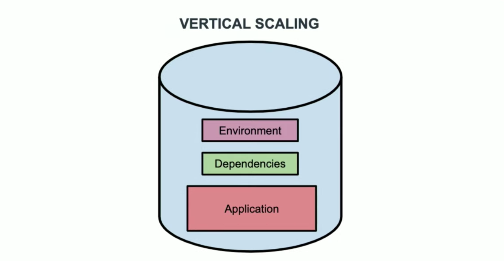
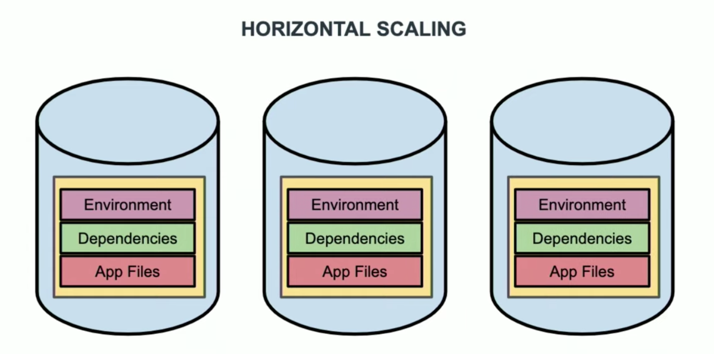
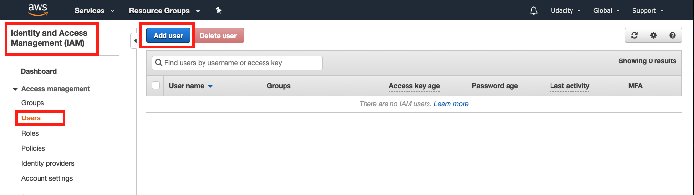
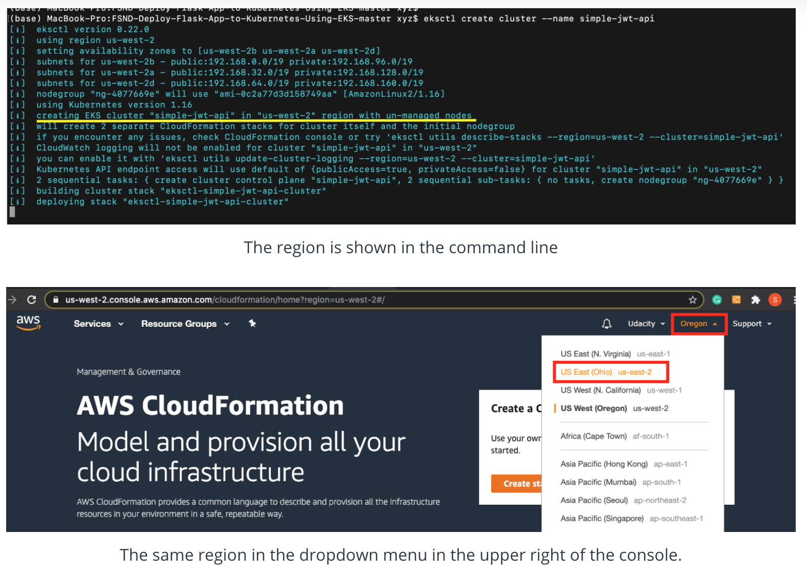
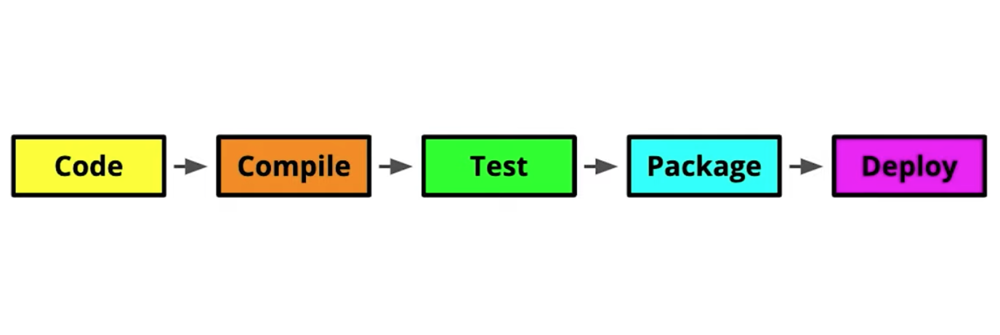
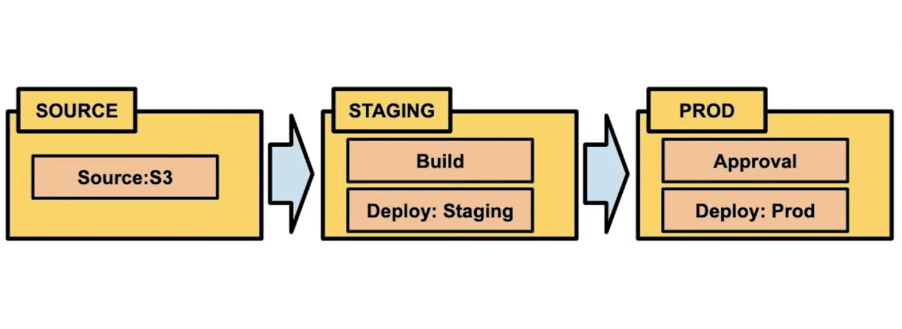
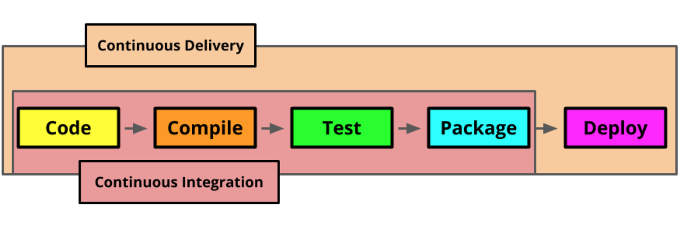

# Lesson 5-3. Deployment

## Lesson Overview

To manage scaling - spinning up new container instances and shutting them down as they are no longer needed - you will use a container orchestration service. There are several options for container orchestration, and in this course we will focus on [Kubernetes](https://kubernetes.io/).

To round out the production pipeline of your application, you will also learn about some tools to automate the process of building, testing, and deploying your code when you make changes. Automatically building and testing your code when changes are made is called [continuous integration](https://en.wikipedia.org/wiki/Continuous_integration). Continuous integration combined with automated deployment is referred to as [continous delivery](https://en.wikipedia.org/wiki/Continuous_delivery).

In this lesson, you will:

- Learn how to deploy a containerized app using AWS' Kubernetes service: [EKS](https://aws.amazon.com/eks/).
- Create a continuous delivery pipeline with [AWS CodePipeline](https://aws.amazon.com/codepipeline/).
- Set up continuous integration with [AWS CodeBuild](https://aws.amazon.com/codebuild/).

## Monitor your AWS Costs and Credits

All AWS services are a pay-as-you-go service, so we urge our students to closely monitor their usage costs and if they have adequate credits available to complete their project/task. Follow the instructions below to do that:

### Step 1. Log into your [AWS account](https://console.aws.amazon.com/console/home)

### Step 2. Examine your costs

Go to [https://console.aws.amazon.com/billing/](https://console.aws.amazon.com/billing/)

You should see the following billing dashboard where it will show your costs.


If your account has been created within one year from the current date, your [AWS Billing Dashboard](https://console.aws.amazon.com/billing/) will also show the resource usage statistics for the free tier services. See the snapshot below:


### Step 3 (optional). Check the value of your credits

Click on the "Credits" from the left navigation menu, and the following screen will show your available credits.


### When will I be charged

There are no tools to limit usage to what’s covered by the AWS Free Tier. This means that you are responsible for the services that you launch. You will be charged standard [pay-as-you-go service rates](https://aws.amazon.com/pricing/) for using AWS resources that exceed the AWS Free Tier limits and the credits provided by Udacity.

#### Shut Down your Resources, if not in use

The Free Tier benefits and the credit amount provided by the Udacity Support team will be sufficient for you to complete your Nanodegree program.

> Note: We recommend you shut down every resource (e.g., EC2 instances, or any other hosted service) on the AWS cloud immediately after the usage, otherwise you will run out of your free promo credits.

Remember, even if you are in the middle of the project and need to step away, **PLEASE SHUT DOWN YOUR RESOURCES**. You can re-instantiate later.

## Kubernetes

| Vertical Scaling | Horizontal Scaling |
|---|---|
|  |  |

Running an application in a single container alone doesn’t leverage the full power of containerization. One of the major strengths of using containers is the ease of scaling the count of container instances up and down to meet demands, known as *horizontal scaling*.

Orchestration platforms automate the deployment and scaling of multiple containers. [Kubernetes](https://kubernetes.io/) is one of the most popular platforms of this type, and the platform you will be using.

### Concepts


- *Cluster*: A group of machines running Kubernetes
- *Master*: The system which controls a Kubernetes cluster. You will typically interact with the master when you communicate with a cluster. The master includes an api, scheduler, and management daemon.
- *Nodes*: The machines in a cluster. These can be virtual, physical, or a combination of both.
- *Pods*: A deployment of an application. This consists of a container, it’s storage resources, and a unique IP address. Pods are not persistent, and may be brought up and down by the master during scaling.


In order to have a persistent way to communicate with ephemeral pods, a higher-level service abstraction is provided. Additionally, in order to have a persistent way to store data, volumes can be attached to pods.

- *Service*: An abstraction for communicating with a set of pods

**Further Research**:

- [General Kubernetes documentation](https://kubernetes.io/docs/home/)
- [Kubernetes volumes documentation](https://kubernetes.io/docs/concepts/storage/volumes/)

## Amazon Elastic Kubernetes Service (EKS)

- A managed Kubernetes service
- Control layer runs the master system
- Secure networks are set up automatically
- You only setup Nodes, Pods, and Services

**Further Research**:

- [What is EKS?](https://docs.aws.amazon.com/eks/latest/userguide/what-is-eks.html)

## AWS Command Line Tool - `AWSCLI`

### Install AWSCLI

There are multiple ways to install [AWSCLI](https://aws.amazon.com/cli/) based on your OS and the mode of installation. To install in a python virtual environment run

```bash
pip install awscli --upgrade
which aws
aws --version
```

For other environments see installation instructions [here](https://docs.aws.amazon.com/cli/latest/userguide/install-cliv1.html).

### Add IAM User - AWS Console



- Sign in to AWS Management Console as a `root`.
- Choose Identity and Access Management (IAM) service console. Go to *Users* section.
- If you haven’t already, add a new user. To keep it simple, note that the newly created user would need an `AdministratorAccess` permission in order to create a cluster.

### Setup AWSCLI with the IAM Credentials

- Go to AWS console, generate Access key ID and Secret access key for an existing IAM User. **You must save the keys locally.**
- On your terminal, run `aws configure list`. It will show you the values as not set.
- Run `aws configure --profile default`. It will prompt you for Access key ID, Secret access key, and Default region name.
- Check that your profile is set, using `aws configure list`.
- For troubleshooting, have a look at the documentation [here](https://docs.aws.amazon.com/cli/latest/userguide/cli-chap-configure.html).

You can find your [AWS account_id](https://docs.aws.amazon.com/IAM/latest/UserGuide/console_account-alias.html#FindingYourAWSId) using the command:

```bash
aws sts get-caller-identity
```

### Create IAM Role - Command Line

We will need to create an IAM role for the project. Let’s learn to create one.

The `trust.json` used in the video above is:

```json
{
   "Version": "2012-10-17",
   "Statement": [
      {
         "Effect":"Allow",
         "Principal": {
            "AWS":"arn:aws:iam::013452265158:root"
         },
         "Action":"sts:AssumeRole"
      }
   ]
}
```

> **Note**: The ARN stands for Amazon Resource Names, which uniquely identify AWS resources. The number 013452265158 used as an ARN above is the AWS account_id. You have to replace the ARN in your AWS account_id.

The `iam-role-policy.json` used in the video above is:

```json
{
   "Version": "2012-10-17",
   "Statement": [
      {
         "Effect": "Allow",
         "Action": [
            "eks:Describe*",
            "ssm:GetParameters"
         ],
         "Resource": "*"
      }
   ]
}
```

Command to create a role, based on `trust.json`:

```bash
aws iam create-role --role-name UdacityFlaskDeployCBKubectlRole --assume-role-policy-document file://trust.json --output text --query 'Role.Arn'
```

Command to add a policy to the specified IAM role, based on `iam-role-policy.json`:

```bash
aws iam put-role-policy --role-name UdacityFlaskDeployCBKubectlRole --policy-name eks-describe --policy-document file://iam-role-policy.json
```

**Read more**:

- [aws create-role](https://docs.aws.amazon.com/cli/latest/reference/iam/create-role.html)
- [aws put-role-policy](https://docs.aws.amazon.com/cli/latest/reference/iam/put-role-policy.html)

## Installing `eksctl`

**eksctl**: A command line tool which greatly simplifies EKS cluster creation

### `eksctl` Installation

- Mac using Homebrew:

```bash
brew tap weaveworks/tap
brew install weaveworks/tap/eksctl
```

If you face any error due to ownership permission, you can change the ownership of those directories to your user.

```bash
sudo chown -R $(whoami) /usr/local/<directory_name>
```

For more installation information see the installation instructions [here](https://eksctl.io/introduction/).

## Installing `kubectl`

**kubectl**: A commandline tool for interacting with kubernetes clusters

**Installation instructions**:

- Installation instructions for `kubectl` can be found [here](https://kubernetes.io/docs/tasks/tools/install-kubectl/).

**More Information**:

- Additional information about `kubectl` syntax and available commands can be found [here](https://kubernetes.io/docs/reference/kubectl/overview/).

## Creating an EKS Cluster

To clarify, there are two consoles in AWS that can be used to manage EKS services:

1. [EKS console](https://us-east-2.console.aws.amazon.com/eks/home?region=us-east-2#/clusters), and
2. [CloudFormation console](https://us-east-2.console.aws.amazon.com/cloudformation/).

[CloudFormation console](https://us-east-2.console.aws.amazon.com/cloudformation/) allows you to provision all the infrastructure resources that you will need using simple configuration (text) files, and we will be using CloudFormation going forward in the course.

### Create an EKS Cluster

- Create the cluster: `eksctl create cluster --name eksctl-demo`
- Go to the CloudFormation console to view progress. If you don’t see any progress, be sure that you are viewing clusters in the same region that they are being created. For example, if `eksctl` is using region `us-west-2`, you’ll need to set the region to “US West (Oregon)” in the dropdown menu in the upper right of the console.



- Once the status is ‘CREATE_COMPLETE’, check the health of your clusters nodes: `kubectl get nodes`
- From the CloudFormation console, select your stack and choose delete from the actions menu, or delete using eksctl: `eksctl delete cluster eksctl-demo`.

> **Note**: We recommend you **SHUT DOWN** every resource (e.g., EC2 instances, CloudFormation stack, or any other hosted service) on the AWS cloud immediately after the usage; otherwise, you will be billed even if the resources are not in "actual" use.

### Summary of Command Line Tools

Note that you have now been introduced to three command line tools that you can use to work with AWS EKS services:

- **AWSCLI**: This tool allows you to interact with a wide variety of AWS services, not just EKS. Although there are aws commands to create or modify EKS services, this is a much more manual approach than using the other options.
- **eksctl**: This command line tool allows you to run commands against a kubernetes cluster. This is the best tool for creating or deleting clusters from the command line, since it will take care of all associated resources for you.
- **kubectl**: This tool is used to interact with an existing cluster, but can’t be used to create or delete a cluster.

#### Additional Resource

- [Further Usage of EKSCTL](https://eksctl.io/usage/creating-and-managing-clusters/)
- [Create your Amazon EKS cluster and worker nodes](https://docs.aws.amazon.com/eks/latest/userguide/getting-started-eksctl.html)

### Creating a EKS Cluster: Key Points

- `eksctl` makes it easy to create a cluster and all of the resources needed to use it
- `kubectl` communicates the clusters master system and can be used to interact with nodes, pods, and services
- When deleting a cluster, use `eksctl delete` or the CloudFormation console to avoid leaving dangling resources

## CodePipeline

### Continuous Delivery

Automating the preparation of code for release



- Used for small incremental releases or frequent releases
- Automates code compilation, testing and packaging
- May involve human QA before final release or automated release to production

### CodePipeline: Continuous delivery as a managed service



- Controls the release process through user defined pipelines
- Pipelines are created either through the CodePipeline console or using `awscli`
- Pipelines watch a source code repository, changes to this repository trigger pipeline action
- Pipelines are made up of stages
- Each stage consists of one or more actions
- There are actions to define the source repository, as well as instructions for testing, building, deploying and options for approval
- Pipelines can be managed and viewed in the [CodePipeline console](https://us-east-2.console.aws.amazon.com/codesuite/codepipeline/pipelines/)

### Additional Information

You can find additional information about CodePipeline [here](https://docs.aws.amazon.com/codepipeline/latest/userguide/concepts.html). For more information on CloudFormation templates see: [Working with CloudFormation Templates](https://docs.aws.amazon.com/AWSCloudFormation/latest/UserGuide/template-guide.html).

- When you create a CodePipeline pipeline you should do so in the context of a CloudFormation stack. CloudFormation is a service for managing the creation of Amazon resources. Resources created together are grouped in a stack. This makes it easy to see related resources in the CloudFormation console.
- CloudFormation stacks are defined in template files, (`.yml`). These files define all of the resources for your stack. CloudFormation templates contain sections for resources used in a stack and parameters to be set when the stack is created.
- A great way to get started with CloudFormation is to use one of the [sample templates](https://aws.amazon.com/cloudformation/resources/templates/). There are instructions for trying a sample template [here](https://docs.aws.amazon.com/AWSCloudFormation/latest/UserGuide/GettingStarted.Walkthrough.html). This walks you through using a sample template to setup and tear down the resources necessary to run a WordPress site.

Soon, you will see a template file `ci-cd-codepipeline.cfn.yml` in the project lesson.

## CodeBuild



An AWS Continuous Integration service. Continuous Integration is the first part of Continuous Delivery.

- Continuous Integration: frequent check-ins to a central repository which trigger automated builds and tests
- CodeBuild: A fully managed continuous integration system offered by AWS
- Codebuild can be added as an action to a CodePipeline stage

### Additional Resources

- General information about CodeBuild can be found [here](https://aws.amazon.com/codebuild/).
- AWS instructions on how to create a pipeline with CodeBuild and CodePipeline can be found [here](https://docs.aws.amazon.com/codebuild/latest/userguide/how-to-create-pipeline.html).
- Documentation on Buildspec files can be found [here](https://docs.aws.amazon.com/codebuild/latest/userguide/build-spec-ref.html).

The instructions that a CodeBuild stage will follow are put in a build spec file named `buildspec.yml`. This file contains all of the commands that the build will run and any related settings. This file should be placed at the root of your project directory. Amazon supplies [CodeBuild samples](https://docs.aws.amazon.com/codebuild/latest/userguide/samples.html), you can see examples of build spec files there. The sample for a simple Docker custom image has the build spec:

```bash
version: 0.2

phases:
   install:
      commands:
         - nohup /usr/local/bin/dockerd --host=unix:///var/run/docker.sock --host=tcp://127.0.0.1:2375 --storage-driver=overlay2&
         - timeout 15 sh -c "until docker info; do echo .; sleep 1; done"
   pre_build:
      commands:
         - docker build -t helloworld .
   build:
      commands:
         - docker images
         - docker run helloworld echo "Hello, World!"
```

You can see that it is divided into the phases ‘install’, ‘pre_build’, and ‘build’. Each phase contains commands, which are the same commands you would use to run Docker locally. You can read about the build spec syntax [here](https://docs.aws.amazon.com/codebuild/latest/userguide/build-spec-ref.html#build-spec-ref-syntax).
